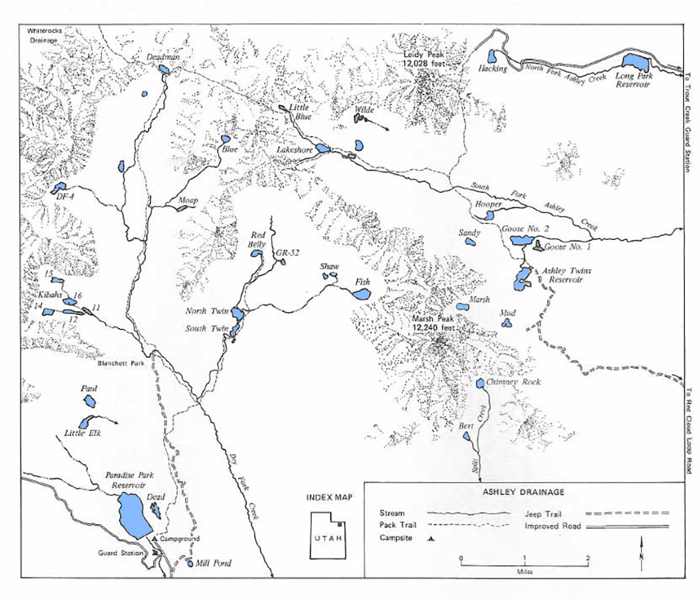

# Ashley Creek Drainage

Ashley Creek Drainage is divided into Dry Fork Creek, South Fork and North Fork. There are over 70 lakes in the Ashley Creek Drainage of which 27 hold natural reproducing trout populations, including brook, cutthroat and a few rainbows.

There are three trailheads into Ashley Creek Drainage. The Dry Fork access found at the Paradise Park Reservoir camground, Ashley Twins Reservoir and a final access 1/2 mile west of Hacking Lake.

Ashley Twins Reservoir serves as the starting point to reach lakes in the South Fork of Ashley Creek. There is 5.5 mil road (accessible by 4×4) from Red Cloud Loop that will take you to Ashley Twins Reservoir.

To reach Hacking Lake there is a road accessible at the Trout Creek Guard Station and runs west 7 miles. 1/2 mile west of Hacking Lake there is a trailhead that provides access to Lakeshore Basion (South Fork of Ashley Creek).

## Lakes

| Lake name | Size (acres) | Max depth (ft) | Fish species | Fishing pressure |
|-----------|--------------|----------------|--------------|------------------|
| Ashley Twins Reservoir, GR-35 | 25 | 18 | Brook trout, cutthroat trout (reproducing) | Moderate |
| Bert, FR-62 | 3.7 | 11 | Brook trout (stocked) | Low |
| Blue, DF-1 | 6.5 | 16 | Brook trout | Moderate |
| Deadman, GR-38 | 7 | 9 | Brook trout, cutthroat trout | High |
| DF-4 | 10 | 23 | Cutthroat | Low |
| East Kibah, DF-11 | 2.9 | 12 | Brook trout (stocked), rainbow trout (reproducing) | Moderate |
| Finger Kibah, DF-12 | 4.7 | 9 | Brook trout | Moderate |
| West Kibah, DF-14 | 7.8 | 15 | Brook trout (stocked) | Moderate |
| Island Kibah, DF-16 | 8 | 14 | Brook trout | Moderate |
| Fish, GR-57 | 17.5 | 40 | Cutthroat trout (reproducing) | High |
| Goose #2, GR-43 | 19.4 | 15 | Cutthroat | Low |
| GR-52 | 2.1 | 4 | Brook trout | Moderate |
| Hooper, GR-46 | 4.5 | 4 | Cutthroat trout | Moderate |
| Lakeshore, GR-34 | 11.1 | 18 | Brook and cutthroat trout | Moderate |
| Little Blue, GR-48 | 3.2 | 6 | Brook trout | Low |
| March, GR-39 | 12.6 | 21 | Brook trout | Moderate |
| North Twin (Dry Fork), GR-50 | n/a | n/a | Brook and cutthroat trout | High |
| Paul, DF-18 | 11.1 | 17 | Brook trout | Low |
| Red Belly, GR-51 | 6.3 | 8 | Cutthroat trout | Moderate |
| Sandy, GR-45 | 5.6 | 10 | Cutthroat trout | Low |
| Shaw, GR-59 | 2.8 | 5 | Cutthroat trout | Low |
| South Twin (Dry Fork), GR-49 | 6.2 | 8 | Brook and cutthroat trout | High |