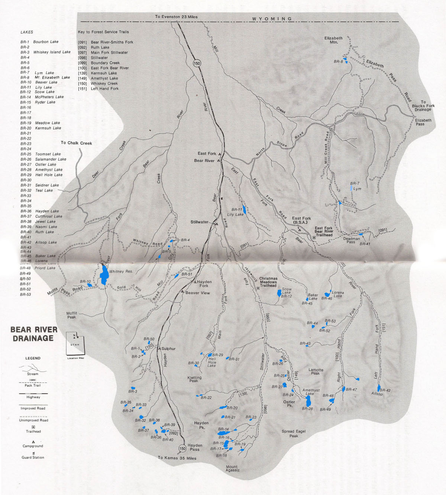

# Bear River Drainage

The Bear River Drainage is the largest drainage in the Uintas. It is located in the northwestern extremity of the Uinta range. Most of the drainage area is rugged with a few narrow drainage basins in the east and timbered ridges to the west.

The drainage include 6 major tributary systems including the West Fork, Hayden Fork, Main Fork, Stillwater Fork, East Fork and the Mill Creek Drainage. The West Fork and Mill Creek areas are not open to public access. The drainage has 38 lakes, a reservoir, and several small lakes. Most lakes contain populations of brook or cutthroat trout. A few lakes are stocked with rainbow trout.

The Bear River Drainage is accessible via the Mirror Lake Highway (U-150) east and north of city of Kamas, Utah and south of Evanston, Wyoming. Other access points include Forest Service routes includinge Whitney, Gold Hill, Stillwater, North Slope, East Fork and Mill Creek Roads. Backcountry access areas include the Christmas Meadows and East Fork-Bear River Trailheads and Ruth Lake and Whiskey Creek Trail turnouts on U-150.

A few of the lakes in the Bear River Drainage are accessible by road, but the majority are remote and accessibe only by trail. The most popular access trails include the Bear River-Smiths Fork Trail, the Main Fork Stillwater Trail, the Ruth Lake Trail, the Boundary Creek Trail, the Stillwater Trail, the East Fork Bear River Trail, the Kermsuh Lake Trail, the Amethyst Lake Trail, the Left Hand Fork Trail, and the Whiskey Creek Trail. Each of these trail systems is identified by a Forest Service trail number.

The most popular fishing lakes in the drainage are Ruth, Bourbon, Lyrn, Teal, Beaver and Whitney Reservoir. If you're seeking solitude, these are the lakes you'll want to avoid.

## Lakes

| Lake name | Size (acres) | Max depth (ft) | Fish species | Fishing pressure |
|-----------|--------------|----------------|--------------|------------------|
| Allsop, BR-42 | 12.3 | 22 | Cutthroat (natural reproducing) | Moderate |
| Amethyst | 42.5 | 59 | Brook and cutthroat trout | Moderate |
| Baker, BR-45 | 3.6 | 8 | Tiger trout | Moderate |
| Beaver, BR-10 | 13.2 | 32 | Rainbow, brook and cutthroat trout | Moderate |
| Bourbon (Gold Hill), BR-1 | 1.9 | 8 | Brook trout | Moderate |
| BR-2 | 0.7 | 5 | Brook trout | Low |
| BR-16 | 1 | 5 | Brook and cutthroat trout (natural reproducing) | Low |
| BR-17 | 2.8 | 7 | Brook trout (natural reproducing) | Moderate |
| BR-18 | 4.8 | 12 | Brook trout | Low |
| BR-24 | 2.4 | 10 | Tiger trout | Low |
| BR-44 | 3.6 | 15 | Tiger trout | Low |
| Cutthroat, BR-37 | 3.8 | 16 | Cutthroat and tiger trout | Moderate |
| Hayden, BR-36 | 4.4 | 5 | Tiger trout | Moderate |
| Kermush | 12.4 | 14 | Cutthroat trout (natural reproducing) | Low |
| Lily, BR-11 | 12.6 | 20 | Rainbow trout | Moderate |
| Lorena, BR-46 | 12 | 20 | Brook trout (stocked) | Low |
| Lym, BR-7 | 6.4 | 20 | Brook trout (natural reproducing) | Moderate |
| McPheters, BR-14 | 28 | 45 | Tiger trout | Moderate |
| Meadow, BR-19 | 2.9 | 5 | Brook trout (natural reproducing) | Low |
| Mt. Elizabeth, BR-8 | 3.1 | 15 | Cutthroat trout | Moderate |
| Norice, BR-47 | 4.8 | 3 | Cutthroat trout (natural reproducing) | Moderate |
| Ostler, BR-27 | 14 | 14 | Tiger trout | Moderate |
| Priord, BR-48 | 12 | 20 | Cutthroat trout (stocked), Tiger trout | Moderate |
| Ruth, BR-40 | 9.7 | 30 | Brook trout (stocked) | High |
| Ryder, BR-15 | 23.7 | 55 | Brook trout | Moderate |
| Salamander, BR-26 | 4.1 | 13 | Brook trout (stocked) | Low |
| Scow, BR-12 | 22.9 | 6 | Brook trout | Low |
| Seidner, BR-31 | 3.2 | 8 | Brook trout (natural reproducing) | Moderate |
| Teal, BR-32 | 6.9 | 14 | Tiger trout | Moderate |
| Toom Set, BR-25 | 2.1 | 11 | Brook trout (natural reproducing) | Low |
| Whiskey Island (Guy's) BR-3 | 5 | 19 | Arctic grayling | Low |