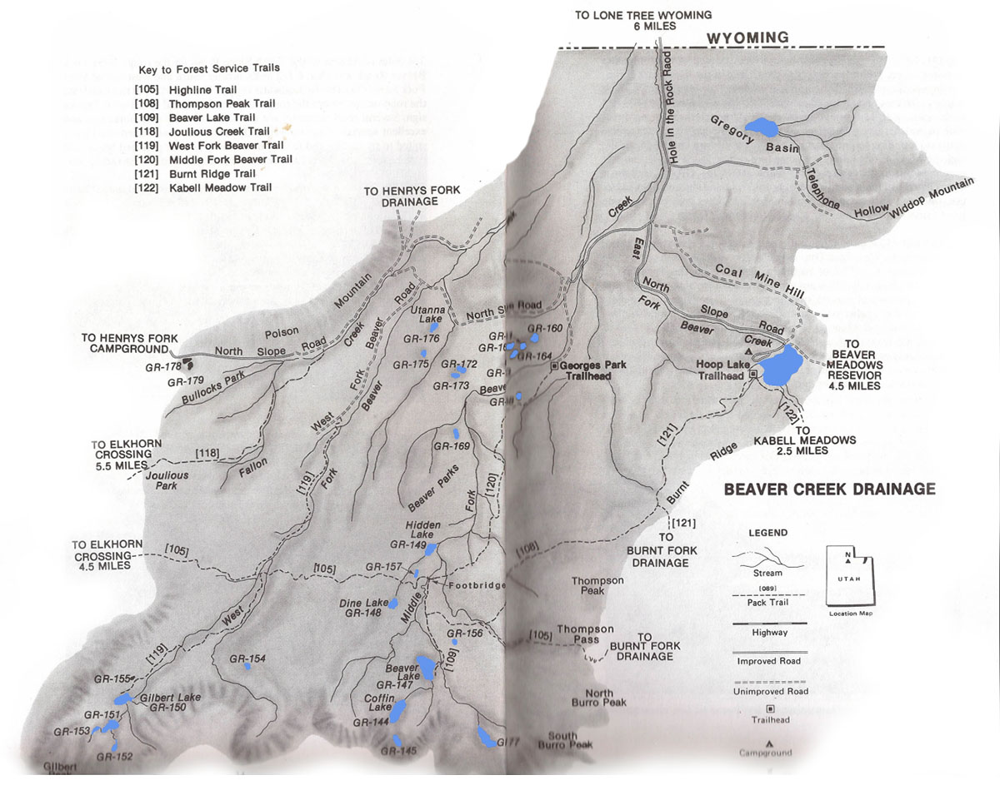

# Beaver Creek Drainage

Beaver Creek Drainage is a remote area located on the north slope of the Uinta Mountain Range approximately 10 miles south of Lonetree, Wyoming. It is characterized by apline basins, timbered ridges and several small lakes. The basin comprises the West Fork, Middle Fork and East Fork drainage systems.

Given its remoteness, fishing pressure is low. Anglers rarely make the effort to visit and fish Beaver Creek's backcountry lakes. If you want to catch trout, and are looking for a little solitude, Beaver Creek Drainage is a great place to plan a fishing adventure.

Bearver Creek Drainage is home to 40 lakes, one large reservoir and a various small ponds. Only 12 of these bodies of water have fish populations. Brookies and cutthroats are the most common catches. If you want to target rainbows, visit Hoop Lake in the East Fork Drainage. Most trout populations are naturally reproducing. Aerial stockings of fingerlings are scheduled every few years as required to maintain trout populations.

The easiest way to access Beaver Creek Drainage is via the Hole in the Rock Road for Lontree, Wyoming and the North Slope Road accessible from Henry Fork Drainage or Burnt Fork Drainage. There are three trails that provide acess to Beaver Creek wilderness area. These include the West Fork Beaver Trail (accessible from West Fork Road), the Thompson Peak Trails (accessible from the Hoop Lake Trailhead), and the Middle Fork Beaver Trail (accessible from Georges Park Trailhead).

## Lakes

| Lake name | Size (acres) | Max depth (ft) | Fish species | Fishing pressure |
|-----------|--------------|----------------|--------------|------------------|
| Beaver, GR-147 | 38.3 | 30 | Brook trout (natural reproducing), Cutthroat | High |
| Coffin, GR-144 | 25.8 | 28 | Cutthroat (stocked), Tiger trout | Low |
| Dine, GR-148 | 5.1 | 15 | Brook trout | Low |
| Gilbert, GR-150 | 15.2 | 2 | Brook and cutthroat trout (natural reproducing) | Moderate |
| GR-145 | 5.6 | 11 | Cutthroat (variable), Arctic grayling | Low |
| GR-151 | 12.6 | 11 | Brook trout (natural reproducing) | Low |
| GR-152 | 4.8 | 13 | Brook trout | Low |
| GR-153 | 3.6 | 2 | Brook and cutthroat trout | Low |
| GR-154 | 2.1 | 6 | Brook trout (stocked) | Low |
| GR-155 | 1.6 | 6 | Brook trout (stocked) | Low |
| GR-160 | 4.8 | 50 | Brook trout | Low |
| GR-161 | 4.3 | 41 | Brook trout (variable) | Low |
| GR-162 | 6.5 | 18 | Brook trout (variable) | Low |
| GR-163 | 6.5 | 16 | Brook trout (variable) | Low |
| GR-172 | 3.6 | 15 | Brook trout (variable) | Low |
| GR-173 | 3.9 | 27 | Brook trout (variable) | Low |
| GR-175 | 18.3 | 11 | Cutthroat trout | Low |
| GR-179 | 5.5 | 11 | Brook trout (variable) | Low |
| Hidden, GR-149 | 6.5 | 18 | Brook trout (stocked) | Moderate |