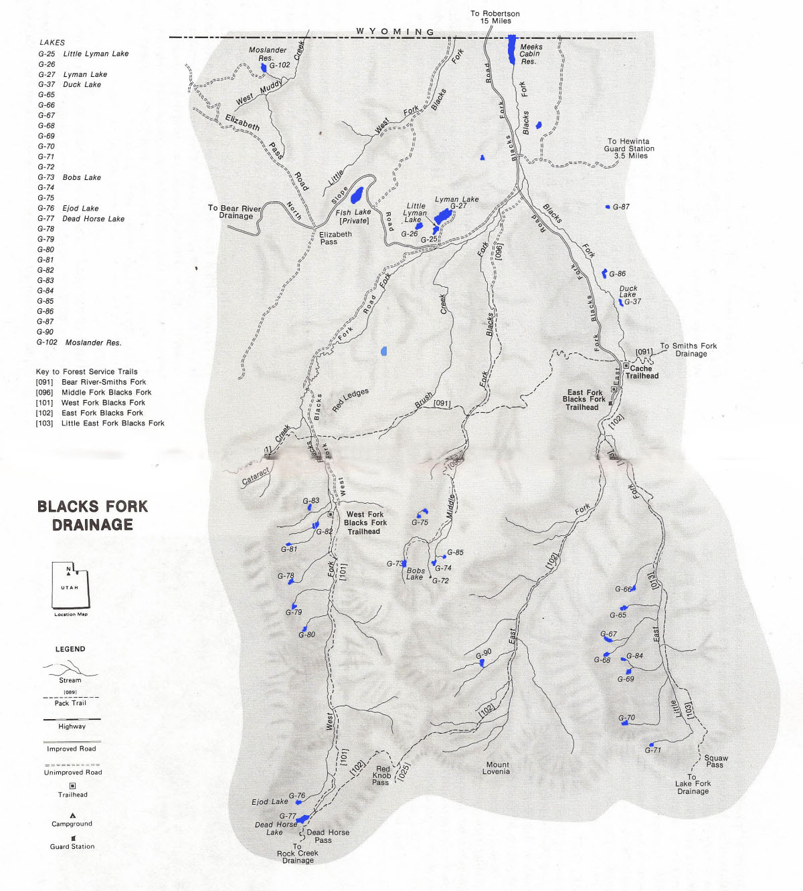

# Blacks Fork Drainage

Blacks Fork Drainage is located on the north slope of the Uintas. It is composed of 4 tributaries, including West Fork, Middle Fork, East Fork and Little East Fork. Blacks Fork Drainage is a rugged alpine tundra composed of narrow river valleys.

There are 33 lakes, 3 reservoirs and over 100 smaller (smaller than 2 acre) ponds located throughout the 4 tributaries. You'll find trout in about half of these waters.

Blacks Fork Drainage is about 15 miles south of U-150 on North Slope Road and 18 miles southwest of Robertson, Wyoming. There are several trails that provide access to back country wilderness areas in the drainage. These include Bear River-Smith Fork Trail, the East Fork Blacks Fork Trail, the West Fork Blacks Fork Trail, the Little East Fork Blacks Fork Trail and the Middle Fork Blacks Fork Trail.

If you're looking for peace and solitude, it doesn't get any better than Blacks Fork Drainage. Most fishing lakes are located some distance from the road and accessible by foot. Only 5 of the lakes can be reached directly by road or trail. Fishing pressure is low in this drainage.

The most popular catches in the Blacks Fork Basin are brook and cutthroat trout. Most trout populations reproduce naturally. Brook and cutthroat populations are augmented periodically by aerial stocking. In the Lyman Lakes, where fishig pressure is higher, brook trout are stocked regularly, as are rainbows. A few lakes offer the possibility of tiger trout and graylings.

If you plan on doing much fishing in the Blacks Fork Drainage, make sure to carefully plan your trip ahead of time. The terrain is rugged, lakes are remote, and there is a bit of distance between fishable waters.

## Lakes

| Lake name | Size (acres) | Max depth (ft) | Fish species | Fishing pressure |
|-----------|--------------|----------------|--------------|------------------|
| Bobs, G-73 | 6.6 | 30 | Cutthroat trout (stocked), Tiger trout | Low |
| Dead Horse, G-77 | 16 | 41 | Cutthroat trout (stocked), Tiger trout | Moderate |
| Duck, G-37 | 5.9 | 5 | Brook trout (stocked) | Moderate |
| Ejod, G-76 | 6.7 | 12 | Cutthroat trout (natural & stocked) | Low |
| G-65 | 5 | 5 | Brook trout (natural reproducing) | Moderate |
| G-66 | 4 | 12 | Brook trout (natural reproducing) | Moderate |
| G-67 | 7.7 | 25 | Brook trout (stocked) | Low |
| G-69 | 4.8 | 13 | Cutthrout (natural reproducing) | Low |
| G-70 | 3.8 | 4 | Cutthroat trout (stocked) | Low |
| G-71 | 4.8 | 14 | Brook trout | n/a |
| G-72 | 1.3 | 6 | Unknown | Low |
| G-74 | 3.4 | 3 | Brook trout | Low |
| G-78 | 3.2 | 9 | Brook trout | Low |
| G-79 | 2.5 | 5 | Brook trout | Low |
| G-80 | 1.8 | 8 | Brook trout | Low |
| G-81 | 1.6 | 5 | Cutthrout trout (stocked) | Low |
| G-82 | 3.8 | 6 | Brook trout | Low |
| G-86 | 6.4 | 7 | Brook trout | Low |
| Little Lyman, G-25 | 5 | 25 | Rainbow trout (stocked) | High |
| Lyman, G-27 | 36.6 | 30 | Rainbow trout (stocked) | Moderate |
| Moslander, G-102 | 11.4 | 29 | Brook trout | Low |