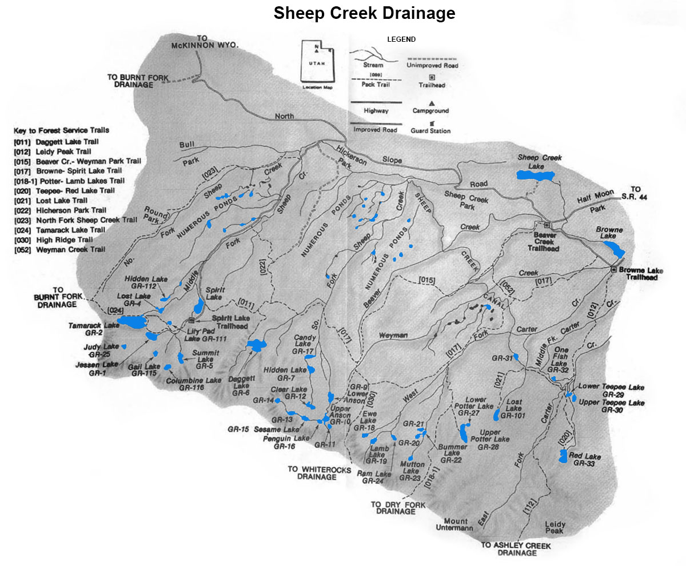

# Burnt Fork Drainage

The Burnt Fork Drainage is located south of Hoop Lake directly west of the Sheep/Carter Creek Drainage in the northern Uintas. This is a relatively small drainage with only 15 sizable lakes and 100 smaller ponds under 2 acres in size. All but a few of the lakes support trout populations.

There is a dirt road from Lonetree, Wyoming that provides direct access to the Burnt Fork drainage. The road runs south to Hoop Lake which is the main access point for the drainage. The Burnt Fork drainage can also be access on its east end from Spirit Lake (in the Sheep/Carter drainage). The most popular lakes in the drainage are found in the Kabell Lake and Island Lakes region. The Island Lakes region also provides access to the Upper Uinta drainage by way of a pass over the Uinta divide.

The most abundant fish species in the Burnt Fork drainage is cutthroat trout. Many of the lakes also contain brook trout. Over half of the lakes contain both species.

## Lakes

| Lake name | Size (acres) | Max depth (ft) | Fish species | Fishing pressure |
|-----------|--------------|----------------|--------------|------------------|
| Bennion, Lower, GR-134 | 7.7 | 13 | Brook and cutthroat trout | Low |
| Bennion, Upper, GR-135 | 2 | 3 | Brook and cutthroat trout | Low |
| Boxer, GR-126 | 6 | 11 | Cutthroat trout | Moderate |
| Burnt Fork, GR-127 | 9.8 | 25 | Cutthroat trout (naturally reproducing) | Moderate |
| Crystal, GR-128 | 5.4 | 5 | Cutthroat trout (naturally reproducing) and brook trout | Low |
| Fish, GR-125 | 38.3 | 23 | Brook and cutthroat trout | Moderate |
| Island, GR-132 | 117.8 | 34 | Cutthroat trout (naturally reproducing) and brook trout | High |
| Kabell, GR-140 | 14.7 | 23 | Cutthroat trout (stocked) | Moderate |
| Round, GR-131 | 24.3 | 38 | Cutthroat trout (stocked) | Moderate |
| Snow, GR-130 | 9.4 | 35 | Cutthroat trout (stocked) | Low |
| Whitewall, GR-133 | 14.5 | 3 | Brook and cutthroat trout | Low |