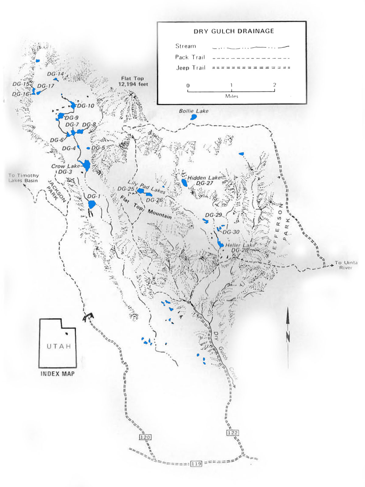

# Dry Gulch Drainage

Dry Gulch is located between the Uinta River and Swift Creek Drainages, approximately 15 miles northeast of the city of Altamont, Utah. It is a relatively small drainage composed of the Heller and Crow basins.

The Heller Basin has 1 reservoir, 3 lakes and just over 30 small ponds. The reservoir and the lakes are the only managed fisheries, but you may also find fish in some of the ponds. The terrain is not as rugged as other drainages in the Uinta range. It is characterized by talus ridges covered by conifer pines and narrow damp meadows. Heller basin is accessed via Dry Gulch Rd (No.122) north of Altamont near the boundary dividing the U.S. Forest Service and Indian Reservation.

Crow basin is long and narrow surrounded by steep rock walls. The floor of the basin is composed of meadows and rigdes covered in conifers. There are 11 lakes that are bigger than 2 acres and several smaller ponds. Not all the lakes are stocked with trout and fishing can be hit or miss. The basin is accessed via the Timothy Creek jeep trail (no.120) located north of Altamont or Neola about 2 miles west of the Dry Gulch turnoff. From there travel 6 miles along Timothy Creek Road to Jackson Park which borders Crow Basin.

Crow Basin can also be accessed from Heller Basin. Follow the Lily Pad lakes trail northwest from Heller Basin over the Flat Top Mountain into Crow Basin. The Crow Basin receives relatively low fishing pressure compared to Heller Basin due to its inaccessibility.

## Lakes

| Lake name | Size (acres) | Max depth (ft) | Fish species | Fishing pressure |
|-----------|--------------|----------------|--------------|------------------|
| Crow, DG-3 | 18 | 26 | Cutthroat trout | Moderate |
| DG-6 | 3 | 5 | Cutthroat trout (stocked) | Low |
| DG-7 | 6 | 4 | Cutthroat trout | Low |
| DG-8 | 7 | 8 | Cutthroat trout | Low |
| DG-9 | 10 | 27 | Cutthroat trout | Low |
| DG-10 | 10 | 12 | Cutthroat trout | Low |
| DG-14 | 2 | 10 | Cutthroat trout (stocked) | Low |
| DG-15 | 3 | 9 | Cutthroat trout | Low |
| DG-16 | 3 | 8 | Cutthroat trout | Low |
| DG-17 | 3 | 12 | Cutthroat trout | Low |
| Heller Reservoir, DG-28 | 12 | 37 | Brook trout | High |
| Hidden, DG-27 | 10 | 39 | Brook trout | Low |
| Lower Lily Pad, DG-26 | 9 | 11 | Brook trout | Low |
| Upper Lily Pad, DG-25 | 12 | 37 | Brook and cutthroat trout | High |