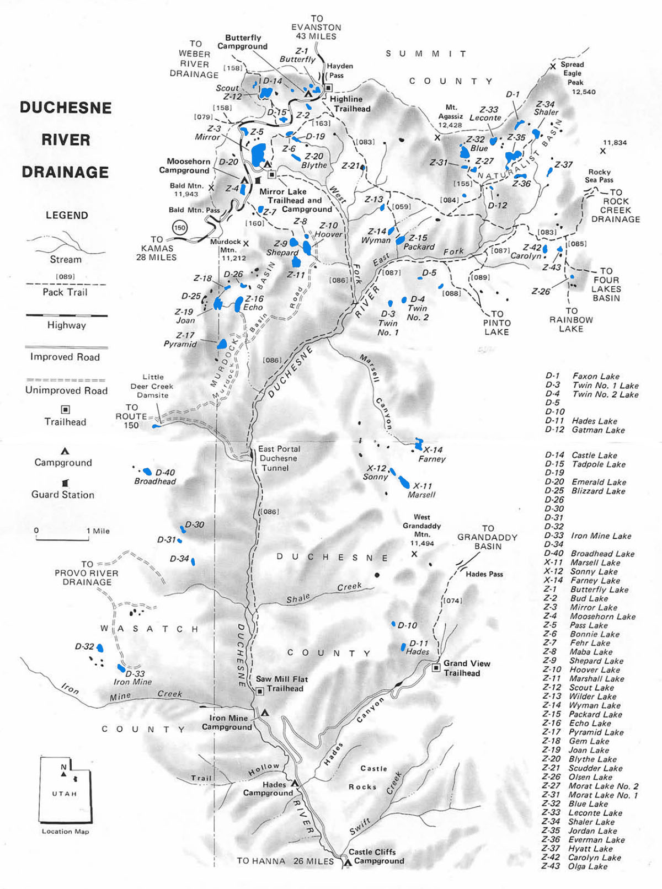

# Duchesne River Drainage

The Duchesne River Drainage is one of the more popular areas to fish in the Uinta Mountains. The drainage has 62 natural lakes with over half of these lakes supporting healthy trout populations. This area is also popular among hikers. It is characterized by wide basins with gentle sloping ridges covered with conifers.

The best access for anglers is via U-150 east of Kamas, UT or Hwy 35 just north of the city of Hanna. The drainage can also be accessed using the Murdock Basin and Iron Mine Mountain Timber roads. Another reason for the basin's popularity is that 15 of the best fishing lakes are directly accessible by vehicle and the remaining lakes can be reached using well-maintained hiking trails.

Most visitors to the Duchesne River Drainage access the area using the Highline and Mirror Lake trailheads just off U-150 or via the Grandview and Sawmill Flat trailheads on Highway 35. The Highline trail is the major inland route providing access to Naturalist Basin and Packard Lake Trail. If you want to access the lakes along the eastern rim of the drainage, such as Sonny, Farney and Marshall, take the Grandaddy Trail from the trailhead.

Lesser traveled access routes into the Duchesne River Drainage include the Olga Lake Trail, East Fork Trail, Skinner Duchesne River Trail, Cutoff Trail, Mirror Lake Trail, Pinto Lake Trail, Blue Lake Trail and Fehr Lake Trail.

The lakes along the Mirror Lake Highway Corridor receive the most fishing pressure of any lakes in the basin. Popularity of these lakes is driven by great fishing and amenities. Moosehorn Lake, Mirror Lake, Butterfly Lakes and Scout Lake offer well-maintained campgrounds, restrooms an picnic facilities. Jordan Lake in the Naturalist Basin recieves the highest fishing pressure and activity. If you're looking for solitude, it's recommended to visit of one of the many other basins in the Uintas.

You'll find both brook trout and cutthroats throughout the drainage, but brookies are by far the more abundant species. Rainbow trout can be found in a few of the larger stocked lakes including Mirror Lake, Moosehorn Lake, Pass Lake and Butterfly Lakes. If you're interested in hooking an Arctic grayling, hit Carolyn Lake.

## Lakes

| Lake name | Size (acres) | Max depth (ft) | Fish species | Fishing pressure |
|-----------|--------------|----------------|--------------|------------------|
| Blizzard, D-25 | 19 | 36 | Brook trout | Moderate |
| Blythe, Z-20 | 5 | 14 | Brook trout (stocked) | Moderate |
| Bonnie, Z-6 | 3.6 | 7 | Brook trout (stocked), Cutthroat | High |
| Broadhead, D-40 | 8.8 | 16 | Brook trout (stocked) | Low |
| Bud, Z-2 | 3.7 | 13 | Brook trout (stocked) | Moderate |
| Butterfly, Z-1 | 4.3 | 13 | Rainbow and brook trout (stocked) | High |
| Carolyn, Z-42 | 5 | 17 | Brook and cutthroat trout | Moderate |
| Castle, D-14 | 1 | 12 | Cutthroat trout, Tiger trout | Moderate |
| D-19 | 1.2 | 6 | Brook and cutthroat trout | Moderate |
| D-26 | 3 | 10 | Brook trout (stocked) | Moderate |
| Echo, Z-16 | 18 | 44 | Golden trout | Moderate |
| Everman, Z-36 | 7.8 | 7 | Brook trout (stocked) | Moderate |
| Farney, X-14 | 12.6 | 14 | Arctic grayling (stocked) | Low |
| Fehr, Z-7 | 5.7 | 27 | Brook trout | High |
| Gem, Z-17 | 3.8 | 14 | Tiger trout | Low |
| Hades, D-11 | 6.4 | 32 | Rainbow and brook trout (stocked) | Low |
| Hoover, Z-10 | 18.6 | 28 | Brook and cutthroat trout | High |
| Joan, Z-19 | 15.2 | 20 | Brook trout | Moderate |
| Jordan, Z-35 | 23.2 | 30 | Brook trout (stocked) | Moderate |
| Leconte, Z-33 | 9.5 | 15 | Cutthroat trout, Arctic grayling | Moderate |
| Maba, Z-8 | 4.2 | 20 | Brook trout | High |
| Marsell, X-11 | 16.4 | 50 | Cutthroat trout (stocked) | Moderate |
| Marshall, Z-11 | 18 | 36 | Cutthroat | High |
| Mirror, Z-3 | 42 | 37 | Rainbow and brook trout (stocked) | High |
| Moosehorn, Z-4 | 8 | 11 | Rainbow trout (stocked) | High |
| Morat #1, Z-31 | 5.4 | 13 | Cutthroat trout (stocked) | Moderate |
| Morat #2, Z-27 | 3.6 | 5 | Cutthroat trout | Moderate |
| Packard, Z-15 | 4.5 | 10 | Brook trout | High |
| Pass, Z-5 | 3.3 | 8 | Rainbow trout | Moderate |
| Pyramid, Z-17 | 15 | 36 | Brook trout | High |
| Scout, Z-12 | 30 | 17 | Rainbow trout | High |
| Shaler, Z-34 | 13 | 7 | Cutthroat trout | Moderate |
| Shepard, Z-9 | 14.2 | 32 | Brook, cutthroat and rainbow trout | High |
| Sonny, X-12 | 5 | 13 | Brook trout (stocked) | Low |
| Wilder, Z-13 | 3.7 | 14 | Brook trout | High |
| Wyman, Z-14 | 6.5 | 17 | Brook trout (stocked) | Moderate |