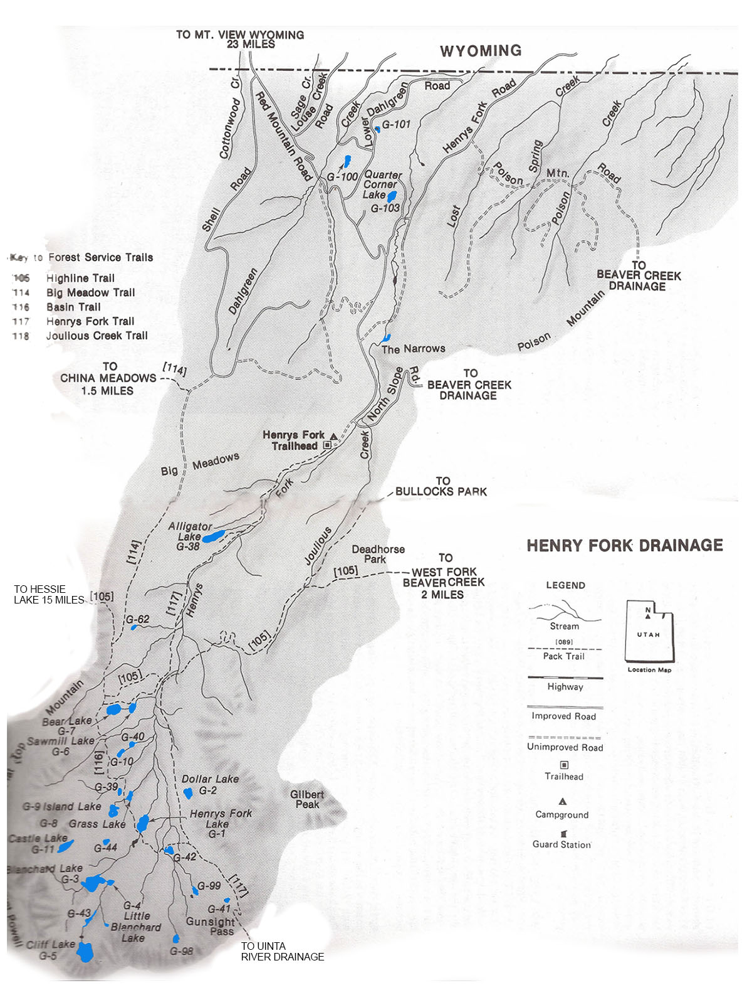

# Henrys Fork Drainage

The Henry Forks Drainage is a relative small drainage located 25 miles south of Mountain View, Wyoming on the north slope of the Uinta Mountains. It is charactized by narrow river valleys, wide timbered slopes, sparse alpine tundra, and tundra-covered plateaus.

The drainage has over 50 lakes and several small ponds under an acre in size. About 40% of the lakes in the Henry Fork Drainage have substantial fish populations. About a third of the fishing lakes in the drainage experience fairly high fishing pressure. If you're looking for more solitude, fish some of the more remote lakes in the basin. Cutthroats are the most popular trout species in Henrys Fork waters, but anglers also report catching brook trout.

Many of the lakes in this drainage receive periodic aerial stockings of trout fingerlings.

The drainage is accessible from Mountain View or Lonetree, Wyoming via well-maintained Forest Service roads. The Henry Fork Trail provides access to most of the lakes in the backcountry. This trail begins at the Henry Fork Trailhead and runs south over Gunsight Pass into the Uinta River Drainage. Smiths Fork Drainage to the west and Beaver Creek Drainage to the east also provide access Henrys Fork Drainage via the interbasin Highline Trail. The interbasin Highline Trail ("Basin Trail") provides access to many of the good fishing lakes along the western end of the Henrys Fork Drainage.

## Lakes

| Lake name | Size (acres) | Max depth (ft) | Fish species | Fishing pressure |
|-----------|--------------|----------------|--------------|------------------|
| Alligator, G-38 | 14.5 | 26 | Trout | High |
| Bear, G-7 | 16.9 | 37 | Brook trout (stocked) | Moderate |
| Blanchard, G-3 | 31.3 | 29 | Cutthroat trout | Moderate |
| Castle, G-11 | 11.5 | 10 | Brook trout (stocked) | Low |
| Cliff, G-5 | 33.1 | 69 | Cutthroat trout (stocked), Tiger trout | Low |
| Dollar, G-2 | 9.7 | 18 | Brook and cutthroat trout | Moderate |
| G-10 | 5.4 | 12 | Brook trout | Low |
| G-39 | 2.6 | 7 | Brook trout | Low |
| G-42 | 4.6 | 2 | Brook and cutthroat trout | Low |
| G-44 | 1.5 | 7 | Cutthroat trout | Low |
| G-62 | 2.2 | 7 | Brook trout | Low |
| G-100 | 7.9 | 13 | Brook trout | Low |
| Grass, G-8 | 5.5 | 4 | Brook and cutthroat trout | Moderate |
| Henrys Fork, G-1 | 19.7 | 19 | Cutthroat trout | Moderate |
| Island, G-9 | 10.4 | 5 | Brook trout (stocked) | Low |
| Little Blanchard, G-4 | 3.6 | 8 | Cutthroat trout | Low |
| Sawmill, G-6 | 7.2 | 21 | Brook and cutthroat trout | High |