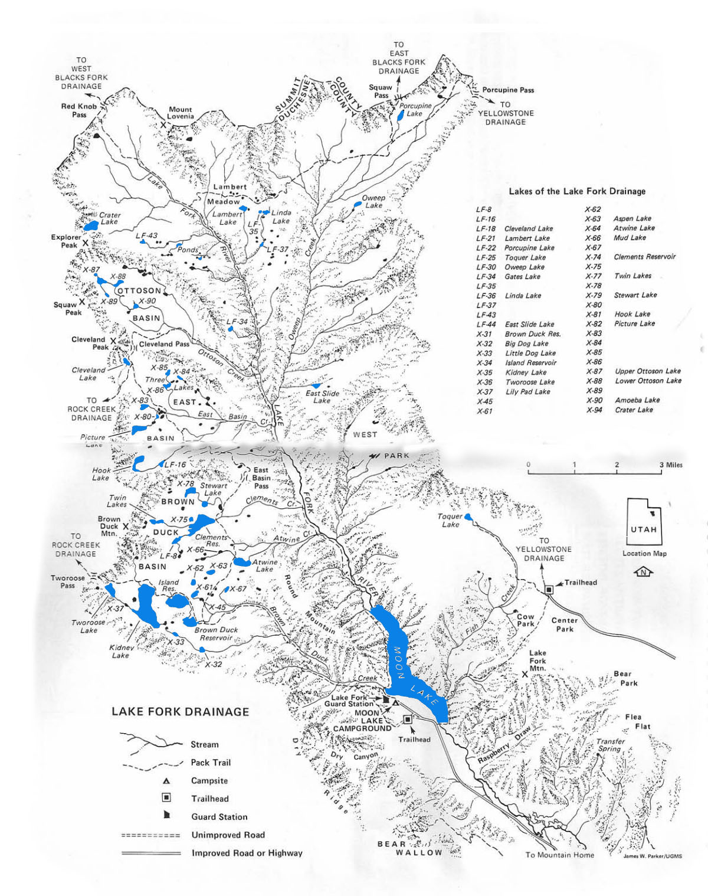

# Lake Fork Drainage

The Lake Fork Drainage is located on the south slope of the Uinta Mountain Range. It is subdivided into three tributaries: Lake Fork, Brown Duck, and Fish. All three of these tributaries flow into Moon Lake.

The main access to Lake Fork Drainage starts 15 miles north of Mountain Home, Utah at Moon Lake. The two major routes into the drainage are Brown Duck and Lake Fork trails. Brown Duck Trail runs 7 miles from Moon Lake into Brown Duck Basin. From there is splits into two trails that lead to Rock Creek Drainage (to the west) and north to Clements Reservoir and East Basin. The Lake Fork Trail runs north from Moon Lake along the main creek until it reaches Ottoson Basin, the Oweep Creek area, and Lambert Meadows. Both the Brown Duck and Lake Fork trails are well maintained.

Lake Fork Drainage has over 90 ponds and lakes—mostly located on the the thick timbered plateaus along the west end. Several of the lakes are over 20 miles from the drainage's main access point at Moon Lake. Lake Fork drainage is also home to Crater Lake, the deepest natural lake in the Uintas.

Some of most popular fishing destinations for anglers include Brown Duck Basin, the Clements Reservoir area and the Atwine Lakes area. Each of these destinations is within 7-11 miles of the main trailhead at Moon Lake. Fishing pressure is at its highest over the July 4th, 24th of July and Labor Day holidays. If you want solitude, peace, or quite, avoid these dates. All other lakes and basins receive low to moderate fishing pressure.

Roughly half of the lakes in the drainage provide abundant fish populations and fishing opportunities. The main game fish include brook and cutthroat trout, with a few rainbows and Arctic graylings mixed in. The most abundant trout populations are found in Crater, Atwine, and Porcupines lakes. Most of the larger streams provide excellent fly fishing for brook and cutthroat trout.

## Lakes

| Lake name | Size (acres) | Max depth (ft) | Fish species | Fishing pressure |
|-----------|--------------|----------------|--------------|------------------|
| Ameba, X-90 | 4.6 | 4 | Cutthroat trout (stocked) | Low |
| Aspen, X-63 | 8 | 26 | Brook trout (stocked) | Moderate |
| Atwine, X-64 | 32 | 35 | Brook trout (natural reproducing) | Moderate |
| Big Dog, X-32 | 6 | 12 | Arctic grayling | Low |
| Brown Duck, X-31 | 30.7 | 12 | Cutthroat trout (natural and stocked) | High |
| Clements, X-74 | 79.2 | 50 | Cutthroat trout (naturally reproducing) | Moderate |
| Crater, X-94 | 28 | 147 | Brook trout | Low |
| East Slide, LF-44 | 5 | Unknown | Brook trout (stocked) | Low |
| Gates, LF-34 | 5.4 | 20 | Brook trout | Low |
| Hook, X-81 | 21 | 19 | Brook trout (stocked) | Low |
| Island, X-34 | 66 | 48 | Cutthroat trout, Tiger trout | High |
| Kidney, X-35 | 190 | 112 | Cuthroat and brook trout | Moderate |
| Lambert, LF-21 | 6.6 | 15 | Brook trout (stocked) | Moderate |
| LF-8 | 7 | 17 | Unknown | Low |
| LF-16 | 3 | 6 | Brook trout (stocked) | Low |
| LF-35 | 1 | 6 | Brook trout (natural reproducing) | Low |
| LF-37 | 1.9 | 3 | Brook trout (stocked) | Low |
| LF-43 | 1.4 | 4 | Brook trout | Low |
| Lilly Pad, X-37 | 1.4 | 8 | Brook and cutthroat trout (naturally reproducing) | Moderate |
| Linda, LF-36 | 3.8 | 5 | Brook trout | Low |
| Little Dog, X-33 | 4.5 | 17 | Brook trout (stocked) | Low |
| Moon Lake | 49.8 | n/a | Brook trout, Mountain whitefish, Rainbow trout, Splake, Cutthroat trout, Kokanee salmon, Tiger trout, Arctic grayling | High |
| Mud, X-66 | 2.5 | 5 | Brook trout (stocked) | Low |
| Oweep, LF-30 | 6.4 | 16 | Brook trout | Low |
| Ottoson, Lower, X-88 | 9.1 | 8 | Cutthroat trout (naturally reproducing) | Low |
| Ottoson, Upper, X-87 | 12.4 | 30 | Cuthroat trout | Low |
| Picture, X-82 | 20 | 13 | Rainbow trout | Low |
| Porcupine, LF-22 | 12.8 | 14 | Brook trout (naturally reproducing) | Low |
| Stewart, X-79 | 9.2 | 22 | Brook trout (stocked) | Low |
| Toquer, LF-25 | 11.1 | 32 | Brook and cutthroat trout | Low |
| Twin, X-77 | 12.9 | 15 | Brook trout (stocked) | Low |
| Tworoose, X-36 | 21.9 | 37 | Cutthroat trout (naturally reproducing) | Moderate |
| X-61 | 5.2 | 10 | Cutthroat trout | Low |
| X-62 | 6 | 10 | Cutthroat trout | Low |
| X-75 | 4.4 | 6 | Cutthroat trout | Low |
| X-78 | 17 | 18 | Cutthroat trout | Low |
| X-80 | 4.6 | 5 | Brook and cutthroat trout (naturally reproducing) | Low |
| X-84 | 4.6 | 18 | Brook trout (stocked) | Low |
| X-85 | 4.7 | 14 | Brook trout | Low |
| X-86 | 6.9 | 12 | Brook trout (stocked) | Low |
| X-89 | 3.4 | Unknown | Unknown | Low |