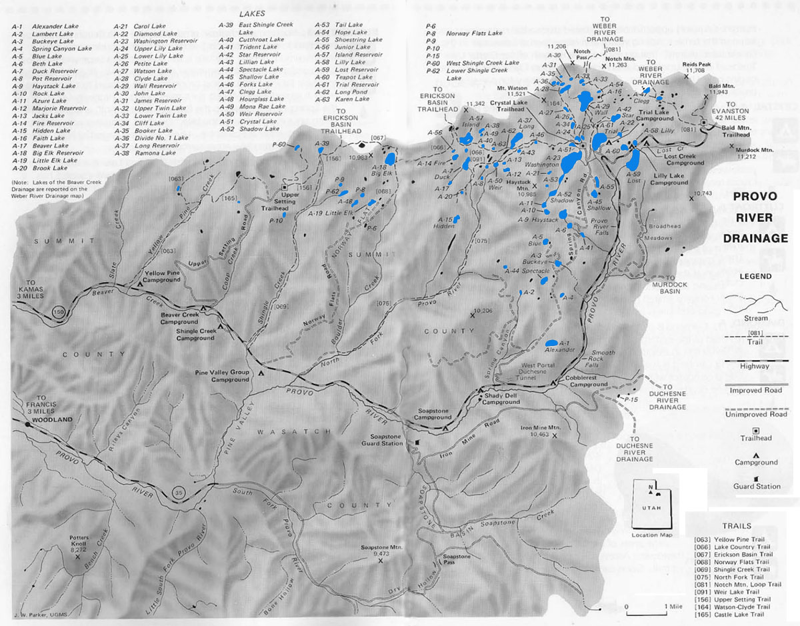

# Provo River Drainage

The Provo River Drainage along the western end of the Uinta Mountain Range is characterized by wide drainage basins, dome-like mountain peaks and timbered ridges. There about 80 lakes and 150 smaller (2 acre) ponds located in the drainage. About 70% of the lakes in the Provo River Drainage offer productive fishing. The majority of lakes are located north west of Mirror Lake Highway (U-150) beginning near the city of Kamas, Utah.

Most fishing in the Provo Drainage occurs along the Mirror Lake Highway corridor. Trail, Lily and Lost lakes are three of the most popular camping lakes and have heavy fishing pressure. Lakes along the popular Lakes Country Trail also experience high fishing pressures. For solitude you're required to fish the remote lake basins an backcountry waters away from high traffic roads and trails.

The Crystal Lake Trailhead provides the main access to the most of the fishable backcountry lakes in the basin. Other access trails within the vecinity include Lake Country Trail, Notch Mountain Loop Trail, and Watson-Clyde Trail. The Watson-Clyde Trail is a bit challenging to locate and navigate. It begins at the northwestern end of Uppler Lily Lake near the Crystal Lake Trailhead. Other important access points for the Provo River Drainage include the Upper Setting and Bald Mountain trailheads which provide access to the Weber Basin lakes.

Together Mirror Lake Highway (U-150) and Forest Service Roads including Norway Flats Road, Spring Caynon Road, and Upper Setting Road provide access to the majority of the Provo River Drainage. Several (20) of the lakes in the drainage are directly accessible by vehicle and many more are accessible within a short walking distance from the road.

Brook trout are by far the most abundant gamefish in the Provo River Drainage and are found in most of the fishable lakes. Stocked cutthroats are also found throughout the drainage. A few of the more popular lakes adjacent to Mirror Lake Highway are stocked with rainbow trout. If you're interested in Arctic grayling, fish Weir and Marjories lakes.

## Lakes

| Lake name | Size (acres) | Max depth (ft) | Fish species | Fishing pressure |
|-----------|--------------|----------------|--------------|------------------|
| Alexander, A-1 | 23 | 28 | Brook trout (stocked) | High |
| Azure, A-11 | 9 | 23 | Arctic grayling | Low |
| Beaver, A-17 | 3.5 | 15 | Brook trout (stocked) | Low |
| Beth, A-6 | 5.4 | 10 | Brook trout | High |
| Big Elk, A-18 | 30 | 85 | Brook and tiger trout | High |
| Blue, A-5 | 8 | 26 | Brook trout (stocked) | High |
| Booker, A-35 | 4.1 | 8 | Brook trout | High |
| Brook, A-20 | 1.1 | 6 | Brook trout | Moderate |
| Buckeye, A-3 | 5 | 8 | Brook trout (stocked) | High |
| Clegg, A-47 | 5.1 | 12 | Brook trout (stocked) | Moderate |
| Cliff, A-34 | 9 | 20 | Cutthroat and tiger trout | High |
| Clyde, A-28 | 16 | 21 | Brook trout | High |
| Crystal, A-51 | 9.8 | 7 | Brook trout (stocked) | High |
| Cutthroat (Clint), A-40 | 3 | 10 | Brook and tiger trout | Low |
| Diamond, A-22 | 3 | 7 | Brook and cutthroat trout | Moderate |
| Divide, #1, A-36 | 3.5 | 5 | Brook trout | High |
| Duck, A-7 | 12.7 | 15 | Brook and cutthroat trout | High |
| Fire, A-14 | 9 | 59 | Cutthroat trout | Moderate |
| Haystack, A-9 | 17 | 29 | Brook and cutthroat trout | High |
| Hidden, A-15 | 8.2 | 25 | Brook trout (stocked) | Moderate |
| Hope, A-54 | 2 | 5 | Brook trout | Low |
| Hourglass, A-48 | 5.7 | 2 | Brook and cutthroat trout | High |
| Island, A-57 | 28 | 40 | Brook, cutthroat and tiger trout | High |
| Jacks, A-13 | 1.2 | 23 | Brook trout | Moderate |
| James, A-31 | 2.1 | 8 | Brook trout (stocked) | Moderate |
| John, A-30 | 4 | 10 | Brook trout | Moderate |
| Junior, A-56 | 2.8 | 11 | Cutthroat and tiger trout | Low |
| Lambert A-2 | 2 | 8 | Brook trout (stocked) | Low |
| Lillian, A43 | 2 | 8 | Brook trout | Low |
| Lilly, A-58 | 4.1 | 13 | Rainbow trout | Moderate |
| Lily, Lower, A-25 | 3.2 | 16 | Brook trout | High |
| Little Elk, A-19 | 13.2 | 31 | Cutthroat trout | Moderate |
| Long Pond, A-62 | 2 | 5 | Brook and cutthroat trout | Moderate |
| Long, A-37 | 35 | 26 | Brook and cutthroat trout | High |
| Lost, A-59 | 62 | 22 | Rainbow trout (stocked) | Moderate |
| Marjorie, A-12 | 13 | 16 | Arctic grayling | High |
| Petit (Junior #5), A-26 | 2 | 3 | Brook trout | Moderate |
| Pot, A-8 | 4 | 28 | Brook trout (stocked) | High |
| Ramona, A-38 | 4.7 | 21 | Brook trout (stocked) | Moderate |
| Rock, A-10 | 8 | 14 | Tiger trout | Moderate |
| Shadow, A-52 | 14 | 20 | Brook trout | High |
| Shingle Creek, East, A-39 | 7 | 44 | Brook and tiger trout | High |
| Shingle Creek, Lower, P-62 | 4 | 14 | Brook trout | Moderate |
| Shingle Creek, West, P-60 | 5 | 12 | Brook trout (stocked) | Moderate |
| Spectacle (Hourglass), A-44 | 9.3 | 17 | Brook trout (stocked) | Moderate |
| Star, A-42 | 16 | 35 | Brook and tiger trout | High |
| Tail, A-53 | 9.8 | 13 | Brook, cutthroat and rainbow trout | High |
| Teapot, A-60 | 13 | 46 | Rainbow and brook trout | High |
| Trial, A-61 | 98 | 68 | Rainbow and brook trout | High |
| Trident, A-41 | 4 | 5 | Brook trout | High |
| Twin, Lower, A-33 | 3 | 14 | Brook trout | High |
| Twin, Upper, A-32 | 9 | 13 | Brook and tiger trout | High |
| Wall, A-29 | 80 | 97 | Brook and tiger trout | High |
| Washington, A-23 | 106 | 70 | Rainbow, cutthroat and brook trout | High |
| Watson, A-27 | 6 | 10 | Brook trout | Moderate |
| Weir, A-50 | 7 | 13 | Cutthroat and arctic grayling | Moderate |