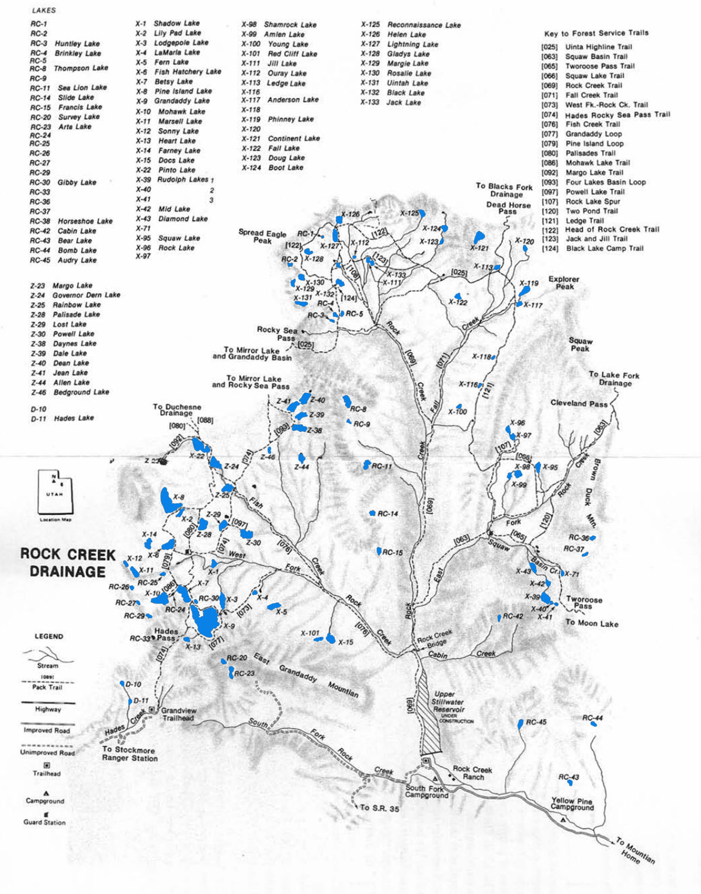

# Rock Creek Drainage

Rock Creek is one of the larger drainages in the Uinta Mountains. It is composed of several smaller drainage systems including the Squaw Basin, Central Basin, and Grandaddy Basin.

The major rivers in the Squaw Basin are the Squaw Basin Creek and East Fork of Rock Creek. The Central Basin is drained by Mainstream Rock Creek and Fall Creek. Rivers in the more popular Grandaddy Basin include Fish Creek and the West Fork of Rock Creek. A small forth basin, due south of Grandaddy Mountain, is drained by the South Fork of Rock Creek.

There are over 120 lakes and ponds located within the Rock Creek Drainage. Good fishing and panoramic views of rolling tundra and scenic timber landscapes draw anglers, hikers and adventure seekers to the drainage. Angling pressure in the Rock Creek Drainage is light to moderate at most fishable lakes.

Visitors can access the Rock Creek Drainage at the trailhead of Upper Stillwater. A main trail runs along Rock Creek up the central drainage basin. Trails split off the main trail following (1) the West Fork of Rock Creek and Fish Creek to Grandaddy Basin, (2) the East Fork of Rock Creek and Squaw Basin Creek to Squaw Basin and Rudolph Lake, and (3) Fall Creek to the eastern region of central basin. Grandaddy Basin can also be accessed from the Grandview transfer in Hades Canyon.

Fishing pressure and recreational activity is high in the Grandaddy Basin, Squaw Basin and Black Lake areas—with recreational use highest in the Grandaddy Basin. Lakes in the Rock Creek Drainage are home to populations of reproducing and stocked cutthroat and brook trout.

## Lakes

| Lake name | Size (acres) | Max depth (ft) | Fish species | Fishing pressure |
|-----------|--------------|----------------|--------------|------------------|
| Allen, Z-44 | 15.2 | 16 | Brook trout (natural reproducing), Arctic grayling | Low |
| Amlen, X-99 | 7.3 | 9 | Brook trout (stocked) | Moderate |
| Anderson, X-117 | 5.8 | 12 | Brook trout (natural reproducing), cutthroat trout | High |
| Arta, RC-23 | 5.4 | 6 | Cutthroat trout | Low |
| Audrey, RC-45 | 13.2 | 25 | Brook trout (stocked) | Low |
| Bedground, Z-46 | 2 | 15 | Brook trout (stocked), Arctic grayling | Moderate |
| Betsey, X-7 | 33.8 | 44 | Cutthroat and brook trout | High |
| Black, X-132 | 11.8 | 14 | Brook trout (stocked) and cutthroat | High |
| Boot, X-124 | 9.1 | 17 | Cutthroat trout | Low |
| Brinkley, RC-4 | 4.2 | 18 | Brook trout | High |
| Cabin, RC-42 | 4.3 | 16 | Brook trout (stocked) | Low |
| Continent, X-121 | 27.4 | 23 | Cutthroat and brook trout | Moderate |
| Dale, Z-39 | 12.9 | 25 | Brook trout (stocked) | High |
| Daynes, Z-38 | 23.2 | 21 | Brook trout (stocked) and arctic grayling | Moderate |
| Dean, Z-40 | 24 | 44 | Brook trout (stocked) | Moderate |
| Diamond, X-43 | 13 | 45 | Brook trout (stocked) | Moderate |
| DOC'S, X-15 | 14.5 | 45 | Brook trout (stocked) | Low |
| Doug, X-123 | 1 | 8 | Cutthroat (natural reproducing) | Low |
| Fern, X-5 | 19.3 | 19 | Brook trout (stocked) | Moderate |
| Fish Hatchery, X-6 | 37.2 | 28 | Brook trout | High |
| Gibby, RC-30 | 1.9 | 25 | Brook trout (stocked) | Moderate |
| Gladys, X-128 | 7.5 | 6 | Brook trout (stocked) | Moderate |
| Governor Dern, Z-24 | 32 | 9 | Brook and cutthroat trout | High |
| Grandaddy, X-9 | 173 | 40 | Brook and cutthroat trout (naturally reproducing) | High |
| Heart, X-13 | 5.7 | 19 | Cutthroat trout (stocked) | High |
| Helen, X-126 | 8.4 | 14 | Brook trout (stocked) | Moderate |
| Horseshoe, RC-38 | 2.9 | 20 | Brook trout (stocked) | Low |
| Huntley, RC-3 | 1.2 | 9 | Brook trout (naturally reproducting) | Low |
| Jack, X-133 | 2.7 | 14 | Cutthroat and brook trout | Moderate |
| Jean, Z-41 | 23.2 | 23 | Brook and cutthroat trout | Moderate |
| Jill, X-111 | 3.6 | 25 | Brook trout (stocked) | Moderate |
| Ledge, X-113 | 3.1 | 13 | Brook trout (stocked) | Moderate |
| Lightning, X-127 | 14.1 | 23 | Brook and cutthroat trout | Moderate |
| Lily Pad, X-2 | 9.5 | 14 | Brook and cutthroat trout | Moderate |
| Lodgepole, X-3 | 20.4 | 29 | Brook trout (stocked) | Moderate |
| Lost, Z-29 | 14 | 15 | Brook trout (stocked) | Moderate |
| Margie, X-129 | 7.5 | 11 | Brook trout (stocked) | Low |
| Margo, Z-23 | 11.1 | 29 | Cutthroat trout (stocked) | Low |
| MID, X-42 | 5.1 | 3 | Brook trout (stocked) | Moderate |
| Mohawk, X-10 | 50.8 | 23 | Brook trout (naturally reproducting) | High |
| Ouray, X-112 | 4 | 6 | Cutthroat and brook trout | Moderate |
| Palisade, Z-28 | 22.7 | 45 | Brook and cutthroat trout | High |
| Phinney, X-119 | 13.6 | 30 | Brook trout (stocked) | Moderate |
| Pine Island, X-8 | 79.6 | 44 | Brook trout (stocked) | High |
| Pinto, X-22 | 46.6 | 36 | Brook trout (stocked) | High |
| Powell, Z-30 | 22.4 | 15 | Cutthroat trout (stocked) | Moderate |
| Rainbow, Z-25 | 17.9 | 15 | Brook trout (stocked) | High |
| Reconnaissance, X-125 | 8.8 | 30 | Brook and cutthroat trout (naturally reproducing) | Low |
| Rock1, X-96 | 4.8 | 19 | Brook trout | Low |
| Rock 2, X-97 | 7.7 | 17 | Brook trout (stocked) | Low |
| Rosalie, X-130 | 8.1 | 8 | Brook trout (stocked) | Low |
| Rudolph 1, X-39 | 25.6 | 46 | Brook trout (stocked) | Moderate |
| Rudolph 2, X-40 | 2.9 | 9 | Brook trout (stocked) | Moderate |
| Rudolph 3, X-41 | 2.4 | 14.5 | Brook trout | Low |
| Sea Lion, RC-11 | 7.9 | 11 | Cutthroat trout (stocked) | Low |
| Shadow, X-1 | 7.2 | 22 | Brook and cutthroat trout | Moderate |
| Shamrock, X-98 | 18.2 | 33 | Brook trout (stocked) | Moderate |
| Squaw, X-95 | 10.4 | 9 | Brook trout (stocked) | High |
| Survey, RC-20 | 6 | 12 | Brook trout (stocked) | Low |
| Thompson, RC-8 | 21.2 | 26 | Brook trout (stocked) | Low |
| Uintah, X-131 | 8.4 | 14 | Brook trout (stocked) | Low |
| Youg, X-100 | 4 | 19 | Cutthroat trout (stocked) | Low |