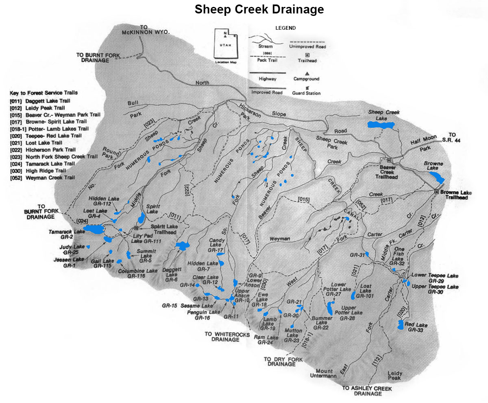

# Sheep Creek/Carter Creek Drainage

Sheep Creek and Carter Creek drainages are located on the north slope of the Uinta Mountain Range. These two drainages are often referred to as the Sheep/Carter Creek Drainage since they geographically are just one drainage system.

The Sheep/Carter Creek Drainage has over 60 lakes. Four of the more popular fishing lakes, Sheep Creek Lake, Browne Lake, Long Park Reservoir, and Spirit lake can be accessed by vehicle. About half of the lakes in the Sheep/Carter Creek Drainage provide abundant trout populations. In additional to 60 larger lakes, the drainage also supports nearly 300 smaller ponds and waterways.

There are a few access points to The Sheep/Carter Creek Drainage. A well-maintained dirt road accessible from Utah SR 44 provides direct access to trail heads at Browne Lake and Spirit Lake. The trail heads at Browne Lake in turn provide access to lakes in the Teepee Lakes area, Weyman Lakes Basin, and Lamb Lakes Basin. The trail heads originating at Spirit Lake lead to Daggett Lake, Weyman Lakes Basin, the Jesson/Tamarack lakes area, as well as several lakes at the eastern end of the Burnt Fork Drainage.

Lakes with the highest fishing pressure include Daggett Lake, the Jesson/Tamarack Lakes, and Teepee Lakes. These lakes are also the most accessible. Fishing pressure to Weyman Lakes Basin is moderate, and you'll find the lowest fishing pressure in the Lamb Lakes Basin. Lakes locate further from trailheads typically receive the least amount of fishing pressure.

Brook trout are the most abundant game fish found in the lakes within the Sheep/Carter Creek Drainage. Cutthroat are present but in fewer numbers than Brook trout. A few lakes contain rainbow trout and graylings.

## Lakes

| Lake name | Size (acres) | Max depth (ft) | Fish species | Fishing pressure |
|-----------|--------------|----------------|--------------|------------------|
| Anson, Lower GR-9 | 14.5 | 20 | Brook and cutthroat trout | Moderate |
| Anson, Upper, GR-10 | 7.7 | 58 | Brook trout (natural reproducing) | Moderate |
| Bummer, GR-22 | 1.9 | 6 | Brook trout, Arctic grayling | Low |
| Clear, GR-12 | 10.2 | 25 | Cutthroat trout, Tiger trout | Low |
| Columbine, GR-116 | 5.7 | 5 | Brook trout (stocked), Tiger trout | Low |
| Daggett, GR-6 | 42.6 | 29 | Rainbow trout (stocked), Tiger trout | High |
| EWE, GR-18 | 3 | 10 | Arctic grayling | Low |
| Gail, GR-115 | 4.5 | 25 | Cutthroat trout | Low |
| GR-11 | 2.6 | 8 | Brook trout (stocked) | Low |
| GR-13 | 9.2 | Unknown | Brook trout (stocked) | Low |
| GR-20 | 5.7 | 8 | Brook trout (stocked) | Low |
| GR-21 | 3.7 | 7 | Brook trout (stocked) | Low |
| GR-31 | 6 | 6 | Brook trout (naturally reproducing) | Low |
| GR-104 | 4.3 | 19 | Trout | Low |
| Hidden, GR-7 | 8.5 | 26 | Brook (stocked) and cutthroat trout | Low |
| Hidden, GR-112 | 4.3 | 8 | Brook and cutthroat trout | Low |
| Jesson, GR-1 | 25.5 | 56 | Brook (stocked) and cutthroat trout, Tiger trout | High |
| Judy, GR-25 | 4.7 | 24 | Brook trout (stocked), Tiger trout | Low |
| Lamb, GR-19 | 6 | 10 | Arctic grayling, Tiger Trout | Low |
| Lost, GR-4 | 3.2 | 7 | Cutthroat trout (naturally reproducing) | Low |
| Lost, GR-101 (Mystery) | 10.2 | 25 | Brook (stocked) and cutthroat trout | Moderate |
| Mutton, GR-23 | 3.8 | 10 | Brook trout (stocked) | Low |
| One Fish, GR-32 | 4.5 | 35 | Brook trout (stocked), Arctic grayling | Low |
| Penguin, GR-16 | 2.1 | 20 | Brook trout (naturally reproducing) | Moderate |
| Potter, Lower, GR-27 | 3.4 | 16 | Brook trout (naturally reproducing) | Moderate |
| Potter, Upper, GR-27 | 21.3 | 75 | Brook trout (naturally reproducing) | Low |
| RAM, GR-24 | 7 | 27 | Cutthroat trout | Low |
| RED, GR-33 | 20.9 | 57 | Brook trout (stocked), Tiger trout | Low |
| Sesame, GR-15 | 6 | 7 | Brook trout (stocked), Arctic grayling | Low |
| Summit, GR-5 | 9.9 | 7 | Arctic grayling | Low |
| Tamarack, GR-2 | 79.1 | 90 | Brook trout and cutthroat trout (naturally reproducing), Tiger Trout | High |
| Teepee, Lower, GR-28 | 4.3 | 28 | Brook trout (stocked) | High |
| Teepee, Upper, GR-30 | 6.5 | 28 | Cutthroat, Tiger trout | Moderate |