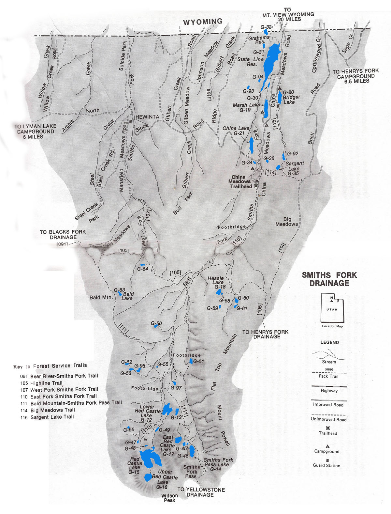

# Smiths Fork Drainage

The Smith Fork Drainage is situated near the center of the Uinta Mountains Range. It is characterized by narrow river valleys, sloping timbered plateaus and glacial cirques. Many visitors comment that it is one of the most beautiful of all basins within the Uintas.

The Smith Fork Drainage comprises two smaller drainages: West Fork Drainage and East Fork Drainage. The East Fork Drainage contains the majority of fishable lakes and waterways. In total, there are over 60 lakes, reservoirs and ponds in the East Fork Drainage alone. Many of these lakes contain fishable trout populations.

The most common gamefish found in the lakes and ponds of the Smiths Fork Drainage are brook and cutthroat trout. Many trout populations are naturally reproducing. Lakes with few natural trout populations receive periodic aerial stockings of fingerlings. Rainbow trout and graylings are also stocked in several of the lakes including Lower Red Castle, China and the more popular Bridger and Marsh Lakes.

Smiths Fork Drainage is accessible from Highway 410 and China Meadows Forest Service Road. It is also accessible from the North Slope Road east of Highway U-150. A few of the fishable lakes in the region are accessible by vehicle, but most are only accessible by trail.

Trails providing access to the wilderness areas of the drainage include (1) East Fork Smiths Fork Trail and (2) the West Fork Smiths Fork Trail. The East Fork Smiths Fork Trail is accessed at the China Meadows Trailhead. The West Fork Smiths Fork Trail is accessed at where the Mansfield Meadows Road ends. From the Black Fork Drainage, the Smith Fork Drainage can be accessed at the Cache Trailhead or from the Yellowstone Drainage at the Bald Mountain Smiths Fork Pass Trail. The lower portion of the drainage can be access via the interbais Highlinee Trail, Sargent Lae Trail and Big Meadows Trail.

Most of the fishable lakes and ponds in the Smith Fork Drainage receive light to moderate fishing pressure. Heaviest fishing pressure occurs at lakes that are most accessible including Marsh Lake, Bridger Lake and China Meadows Lake. You'll find moderate fishing pressure at Red Castle, Lower Red Castle, and Hessie Lakes.

## Lakes

| Lake name | Size (acres) | Max depth (ft) | Fish species | Fishing pressure |
|-----------|--------------|----------------|--------------|------------------|
| Bald, G-63 | 6.4 | 23 | Brook trout (naturally reproducing) | Low |
| Bridger, G-20 | 21 | 15 | Rainbow and brook trout (stocked) | High |
| China, G-21 | 31.2 | 45 | Brook trout, cutthroat trout, arctic grayling | Moderate |
| G-13 | 7.9 | 17 | Brook trout (stocked) | Low |
| G-34 | 1 | 6 | Brook and rainbow trout | Moderate |
| G-36 | 4.7 | 11 | Trout | Low |
| G-45 | 3.1 | 12 | Brook trout (stocked) | Low |
| G-49 | 3.9 | 11 | Brook, cutthroat and rainbow trout | Low |
| G-50 | 3.7 | 5 | Brook trout (naturally reproducing) | Moderate |
| G-51 | 8.1 | 5 | Brook trout | Low |
| G-52 | 2.6 | 4 | Cutthroat (stocked) | Low |
| G-53 | 5.5 | 17 | Cutthroat and brook trout (naturally reproducing) | Moderate |
| G-56 | 1.5 | 12 | Brook trout | Low |
| G-58 | 1.3 | 5 | Cutthroat | Low |
| G-59 | 3.2 | 24 | Brook trout (stocked) | Low |
| G-60 | 2.5 | 9 | Brook trout, Tiger trout | Moderate |
| G-61 | 3.1 | 6 | Brook trout | Low |
| G-64 | 3.4 | 5 | Cutthroat trout (stocked), Tiger trout | Low |
| Grahams, G-32 | 18.5 | 25 | Unknown | Unknown |
| Hessie, G-18 | 13.2 | 18 | Cutthroat trout (stocked), Tiger trout | Moderate |
| Marsh, G-19 | 33.6 | 35 | Brook and rainbow trout (stocked) | High |
| Red Castle, G-15 | 168.2 | 103 | Cutthroat trout (stocked), Tiger trout | High |
| Red Castle, East, G-17 | 21.1 | 58 | Cutthroat trout, Tiger trout | Moderate |
| Red Castle, Lower, G-12 | 45 | 28 | Brook trout | Moderate |
| Red Castle, Upper, G-16 | 25.6 | 72 | Cutthroat (stocked), Tiger trout | Moderate |
| Sargent, G-35 | 8.3 | 22 | Trout | Low |
| Smiths Fork Pass, G-14 | 26.1 | 17 | Cutthroat trout, Tiger trout | Low |