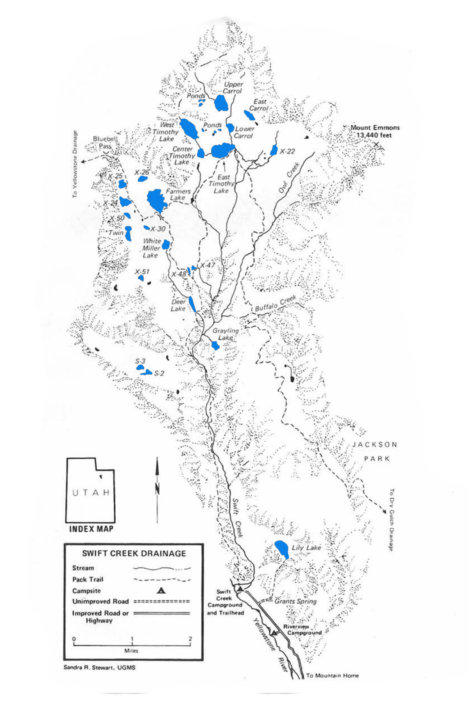

# Swift Creek Drainage

Compared to other drainages in the Uinta Mountains, Swift Creek Drainage is small and steep-sided. It is characterized by a rapidly flowing stream through its center and lakes that sit high above on timbered plateaus. It has 17 large lakes and several smaller ponds. Most of the fishable lakes are located in the Timothy Lakes Basin and Farmers Lake area.

Access to Swift Creek Drainage begins at the Swift Creek Campground about 15 miles north of Mountain Home, Utah. The main trail into the drainage is well maintained, but steep and rocky.

Fishing pressure is highest at Deer, White Miller, and East Timothy. Camping is best at White Miller, Lily, East Timothy, X-30 and Center Timothy. If you're traveling by horse, you'll find the best horse feed at White Miller, X-25, X-24 and East Timothy.

## Lakes

| Lake name | Size (acres) | Max depth (ft) | Fish species | Fishing pressure |
|-----------|--------------|----------------|--------------|------------------|
| Carrol, East, X-21 | 10 | 19 | Cutthroat trout | Moderate |
| Carrol, Lower, X-17 | 9 | 7 | Brook trout | Moderate |
| Carrol, Upper, X-18 | 35 | 48 | Brook trout | Moderate |
| Deer, X-55 | 12 | 4 | Brook and cutthroat trout (naturally reproducing) | High |
| Farmers, X-23 | 63 | 24 | Brook trout (stocked) | Moderate |
| Grayling, X-56 | 8.5 | 33 | Brook trout | High |
| Lily, S-15 | 20 | 39 | Brook trout (stocked) | High |
| Timothy, Center, X-20 | 10 | 18 | Brook trout (naturally reproducing) | High |
| Timothy, East, X-16 | 40 | 35 | Cutthroat trout | High |
| Timothy, West, X-19 | 45 | 45 | Brook trout | Moderate |
| Twin, X-49 | 14 | 15 | Cutthroat trout | Moderate |
| White Miller, X-54 | 11 | 18 | Brook trout (stocked) | High |
| X-22 | 9 | 8 | Brook and cutthroat trout | Moderate |
| X-24 | 21.4 | 30 | Cutthroat trout (stocked) | Low |
| X-25 | 15.9 | 27 | Cutthroat trout | Moderate |
| X-26 | 7.7 | 23 | Brook trout | Low |
| X51 | 5 | 8 | Cutthroat trout | Low |