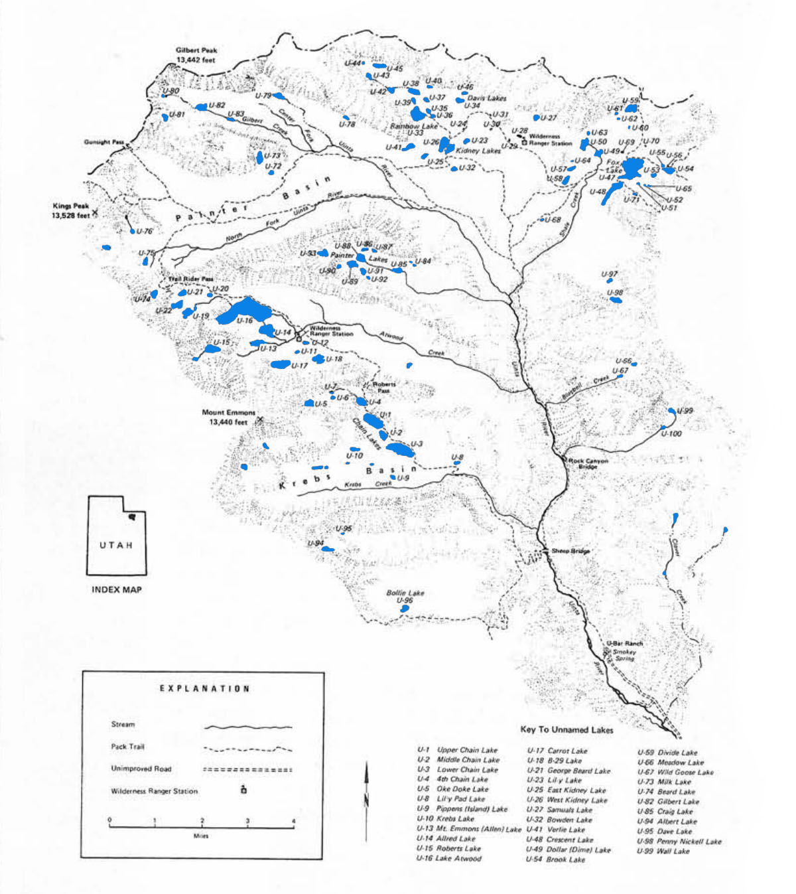

# Uinta River Drainage

The Uinta River Drainage is among the largest in the Uinta Mountain Range. It is comprised of seven major basins including Painter, Painter Lakes, Atwood, Krebs, Gilbert, Fox-crescent and Kidney Lakes, as well as several smaller basins. The seven basins are accessible by foot or horse.

The Uinta Canyon Trailhead and West Fork of the Whiterocks River drainage provide the main access to the Uinta River Drainage. The Uinta Canyon trail is located 21 miles north of Neola, Utah. It provides access to the western region of the Uinta River drainage. The West Fork of the Whiterocks River drainage is locate 25 miles north of Whiterocks, Utah. It provides access to the eastern region of the drainage.

The Uinta River Drainage has over 90 lakes and ponds. Over half of these lakes support productive trout fisheries. The most abundant fish species in the Uinta River Drainage are book and cutthroat trout. A few lakes also contain rainbow and golden trout. Streams and tributaries to the major lakes usually provide good trout fishing as well.

The heaviest fishing pressure is at Kidney lakes, Chain lakes, Fox-Cresent lakes and Atwood lakes. If you're looking for peace and quite, you'll want to avoid these lakes during the mid-summer months.

## Lakes

| Lake name | Size (acres) | Max depth (ft) | Fish species | Fishing pressure |
|-----------|--------------|----------------|--------------|------------------|
| Albert, U-94 | 7 | 8 | Cutthroat trout | Low |
| Allred, U-14 | 34 | 30 | Brook trout | Moderate |
| Atwood, U-16 | 200 | 40 | Brook trout and golden trout | Moderate |
| B-29 Lake, U-18 | 19 | 7 | Brook trout | Low |
| Bear, U-74 | 9 | 15 | Brook trout (stocked) | Low |
| Bollie, U-96 | 10 | 15 | Cutthroat trout | Low |
| Bowden, U-32 | 4.5 | 14 | Brook trout (stocked) | Moderate |
| Brook, U-54 | 10 | 8 | Brook trout (stocked) | Low |
| Carrot, U-17 | 31 | 31 | Brook trout (stocked) | Low |
| Chain 1 (Lower), U-3 | 62 | 38 | Brook trout (natural reproducing) | High |
| Chain 2 (Middle), U-2 | 14.4 | 13 | Brook trout (natural reproducing) | Moderate |
| Chain 3 (Upper), U-1 | 51 | 44 | Brook trout | Moderate |
| Chain 4, U-4 | 13.5 | 31 | Cutthroat trout | Low |
| Craig, U-85 | 9.3 | 14 | Cutthroat and brook trout | Low |
| Crescent, U-48 | 31 | 23 | Cutthroat and brook trout | Moderate high |
| Davis, North, U-46 | 7.3 | 7 | Brook trout | Low |
| Davis, South, U-34 | 6.1 | 4 | Brook trout | Low |
| Divide, U-59 | 18.9 | 39 | Cutthroat trout | Low |
| Dollar, U-49 | 11.5 | 6 | Brook trout | Moderate |
| Fox, U-47 | 102 | 47 | Brook and cutthroat trout | Moderate |
| George Beard, U-21 | 7.4 | 15 | Brook trout (natural reproducing) | Low |
| Gilbert, U-82 | 14.6 | 20 | Brook trout (stocked) | Low |
| Kidney, East, U-25 | 13.7 | 12 | Brook trout | High |
| Kidney, West, U-26 | 20 | 4 | Brook trout | High |
| Lily, U-23 | 5.3 | 15 | Brook trout | Low |
| Lily Pad, U-8 | 3.7 | 7 | Brook and rainbow trout (natural reproducing) | Moderate |
| Milk, U-73 | 13.1 | 35 | Brook and cutthroat trout | Low |
| Mt. Emmons, U-13 | 15.5 | 21 | Brook trout, Golden Trout | Low |
| Oke Doke, U-5 | 12.9 | 38 | Cutthroat (stocked) | Low |
| Penny Nickell, U-98 | 11.5 | 43 | Cutthroat (stocked) | Low |
| Pippen, U-9 | 3.2 | 3 | Brook trout (natural reproducing) | Moderate |
| Rainbow, U-33 | 35.1 | 20 | Brook trout (natural reproducing) | Moderate |
| Roberts, U-15 | 23.3 | 38 | Cutthroat and brook trout | Low |
| Samuals, U27 | 4.8 | 7 | Brook trout | Low |
| U-19 | 15 | 8 | Brook trout, Golden trout | Low |
| U-35 | 4.4 | 5 | Cutthroat and brook trout | Moderate |
| U-36 | 4.6 | 7 | Brook trout (natural reproducing) | Moderage |
| U-37 | 6.3 | 12 | Brook trout (stocked) | Low |
| U-38 | 15.7 | 13 | Cutthroat trout | Moderate |
| U-42 | 7.6 | 7 | Cutthroat trout | Low |
| U-45 | 5 | 5 | Cutthroat trout | Low |
| U-50 | 18 | 8 | Brook trout | Low |
| U-75 | 6.9 | 18 | Brook trout | Low |
| U-76 | 6 | 15 | Cutthroat trout | Low |
| U-88 | 14 | 18 | Brook trout | Low |
| U-89 | 11.5 | 15 | Brook trout | Low |
| U-93 | 11.1 | 8 | Cutthroat trout (stocked) | Very low |
| Verlie, U-41 | 10.6 | 12 | Brook trout (natural reproducing) | Moderate |