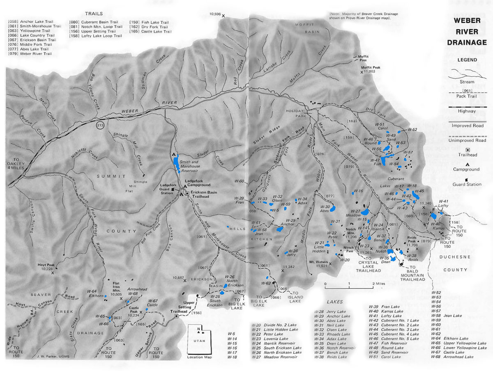

# Weber River Drainage

The Weber River Drainage is located at the western end of the Uinta Mountain Range. There are roughly 60 lakes and 100 smaller ponds in the drainage. The area is characterized by timbered slopes and talus ridges.

The easiest way to access the Weber River Drainage is off Hwy 213 just east of the city of Oakley or Hwy U-150 just east of Kamas. Access points along Hwy 213 include the Erickson Basin Trailhead located near the Ledgefork Campground. There are also a couple good trails into the drainage that can be accessed along the Forest Service right-of-way road at Holiday Park. Much of the area around Holiday Park is privately own, so be curteous to property owners.

Some of the best access points to fishable lakes in the Weber River Drainage are accessed via the Upper Setting, Bald Mountain, Crystal Lake, and Weber River trailheads along U-150. These trails drop over the top into the drainage.

There are several lakes in the Weber River Drainage that are more remote and inaccessible. These lakes can be accessed via the Lofty Lake Loop Trail, Notch Mountain Loop Trail, Yellowpine Trail, and Smith-Morehouse Trail. When exploring the backcountry lakes in the Weber River Drainage makes sure to accurately map your course before arriving.

About sixty percent of the lakes in the Weber River Drainage have fishable populations of trout. Brook trout are the most likely catch, but cutthroat are also present. Fishing pressure for the lakes and ponds in the Weber Basin is light to moderate.

The best trout fishing lakes—and those with the heaviest fishing pressure—include Cuberant #4, Abes, Fish, Erickson, Dean, North, Round, Notch, Yellowpine, and Sand Lakes. If you're seeking solitude, fish elsewhere. If you want to try your hand at catching some Arctic grayling, fish Round and Sandy Lakes. You'll also find good trout fishing in some of the more remote streams throughout the drainage.

## Lakes

| Lake name | Size (acres) | Max depth (ft) | Fish species | Fishing pressure |
|-----------|--------------|----------------|--------------|------------------|
| Abes, W-30 | 21.6 | 62 | Cutthroat trout | High |
| Adax, W-34 | 5 | 10 | Cutthroat trout | Low |
| Anchor, W-29 | 13 | 50 | Brook trout | Moderate |
| Arrowhead, W-68 | 2.1 | 26 | Brook trout (naturally reproducing) | Moderate |
| Carol, W-51 | 3 | 25 | Brook trout (stocked) | Low |
| Castle, W-67 | 10 | 30 | Tiger trout | Moderate |
| Cuberant #1, W42 | 3.5 | 18 | Brook trout | Moderate |
| Cuberant #2, W43 | 3.2 | 6 | Brook and cutthroat trout | Moderate |
| Cuberant #3, W44 | 3.5 | 24 | Brook trout | Moderate |
| Cuberant #4, W45 | 22 | 25 | Tiger trout | Moderate |
| Cuberant #5, W46 | 5 | 15 | Unknown | Low |
| Dean, W-35 | 12 | 16 | Brook trout, Arctic grayling | High |
| Divide #2, W-20 | 3.5 | 10 | Trout | Low |
| Elkhorn, W-64 | 1.5 | 10 | Brook trout (stocked) | Moderate |
| Erickson, South, W-25 | 10 | 12 | Brook trout (stocked) | Moderate |
| Erickson, North, W-26 | 9 | 12 | Brook trout (stocked) | High |
| Fish, W-47 | 46 | 38 | Arctic grayling, brook trout | High |
| Fran, W-39 | 3 | 8 | Brook trout | Moderate |
| Ibantik, W-24 | 10.2 | 28 | Brook trout (naturally reproducing) | High |
| Jean, W-58 | 3 | 25 | Cutthroat trout (stocked) | Low |
| Jerry, W-28 | 3.2 | 16 | Brook trout (stocked) | Low |
| Kamas, W-40 | 17.1 | 42 | Tiger trout | Moderate |
| Little Hidden, W-21 | 8 | 28 | Brook trout | Moderate |
| Lofty, W41 | 4 | 20 | Tiger trout | Moderate |
| Lovenia, W-23 | 2.5 | 11 | Brook trout | High |
| Meadow, W-27 | 29 | 46 | Cutthroat trout (naturally reproducing), Tiger trout | High |
| Neil, W-31 | 1.1 | 20 | Brook trout | Low |
| Notch, W-36 | 20.2 | 57 | Brook and cutthroat trout | Moderate |
| Olsen, W-32 | 7 | 13 | Brook trout (stocked) | Moderate |
| Peter, W-22 | 3 | 13 | Unknown | Low |
| Reids, W-38 | 3 | 8 | Brook trout | Low |
| Rhoads, W-33 | 7.5 | 32 | Brook trout (naturally reproducing) | Moderate |
| Round, W-48 | 5 | 36 | Cutthroat trout, Arctic grayling | Moderate |
| Sand, W-49 | 19.3 | 41 | Arctic grayling | Low |
| W-16 | Unknown | Unknown | Brook trout (stocked) | Low |
| W-52 | 3.6 | 25 | Brook trout | Moderate |
| W-53 | 2.2 | 9 | Brook trout (stocked) | Low |
| W-57 | 3 | 8 | Brook trout (stocked) | Moderate |
| W-59 | 4 | 10 | Brook trout (naturally reproducing) | Moderate |
| W-62 | 2.1 | 18 | Brook trout (stocked) | Low |
| Yellowpine, Lower, W-66 | 2 | 7 | Brook trout (stocked) | High |
| Yellowpine, Upper, W-65 | 3 | 12 | Brook trout (stocked) | High |