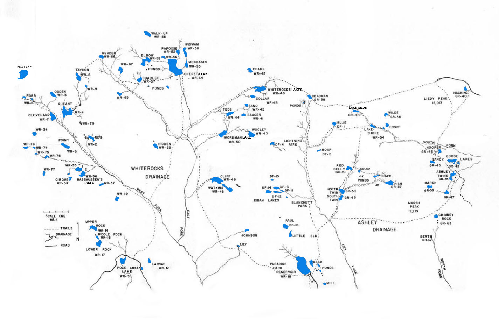

# Whiterocks Drainage

The Whiterocks Drainge is one of the largest basins in the Uinta Mountains. Of its 80 lakes and ponds, over half support abundant populations of brook and cutthroat trout. Fishing pressure varies throughout the basin. A few lakes are regularly fished by anglers, while others may remain untouched for several seasons.

Whiterocks Drainage is divided into two sub-drainages: the East Fork and West Fork. The West Fork Lakes region begins with Pole Creek Lake which is located 15 miles north of Whiterocks via a dirt road. The East Fork Lakes region begins at Paradise Park Reservoir which lies 20 miles north of LaPoint—and is also accessed by dirt road. Both Whiterocks and LaPoint can be reached by taking oiled road which runs north and east of Roosevelt, UT.

## Lakes

| Lake name | Size (acres) | Max depth (ft) | Fish species | Fishing pressure |
|-----------|--------------|----------------|--------------|------------------|
| Chepeta, WR-64 | 50 | 60 | Brook (stocked) and cutthroat trout | High |
| Cleveland, WR-7 | 26 | 6 | Brook (stocked) and cutthroat trout | High |
| Cliff, WR-49 | 40 | 55 | Brook (stocked) and cutthroat trout | Moderate |
| Dollar, WR-43 | 7 | 15 | Brook, rainbow and cutthroat trout, Tiger trout | Moderate |
| Elbow, WR-58 | 25 | 17 | Brook trout (stocked) | Moderate |
| Figure-eight WR-56 | 3 | 5 | Cutthroat trout | Low |
| Hidden, WR-63 | 12 | 27 | Brook trout | Moderate |
| Larvae, WR-12 | 4 | 28 | Brook trout | High |
| Lower Rock, WR-17 | 12 | 39 | Cutthroat trout, Brook trout (stocked) | Moderate |
| Middle Rock, WR-16 | 6 | 10 | Brook and cutthroat trout | Low |
| Mocassin, WR-53 | 11 | 27 | Brook and cutthroat trout | Moderate |
| Ogden, WR-5 | 14 | 21 | Cutthroat and brook trout | Low |
| Papoose, WR-52 | 8 | 22 | Cutthroat and brook trout | Moderate |
| Paradise Park Reservoir, WR-18 | 137 | 36 | Rainbow trout (stocked) | High |
| Pearl, WR-45 | 2.5 | 15 | Brook trout (stocked) | Low |
| Point (Adams) WR-6 | 16 | 21 | Brook trout (stocked) | Low |
| Pole Creek Lake, WR-13 | 5 | 10 | Tiger trout, rainbow trout | High |
| Queant, WR-4 | 57 | 44 | Brook trout (stocked) | High |
| Rassmussen #1, WR-35 | 19 | 5 | Brook trout (stocked) | Moderate |
| Rassmussen #2, WR-36 | 14 | 8 | Brook trout (stocked) | Moderate |
| RC #1, WR-2 | 10 | 16 | Brook and cutthroat trout (stocked) | Low |
| Reader, WR-66 | 10 | 10 | Brook and cutthroat trout | Moderate |
| Sand, WR-42 | 6 | 5 | Brook and cutthroat trout | Low |
| Sharlee, WR-57 | 10 | 4 | Brook and cutthroat trout | Low |
| Taylor, WR-8 | 25 | 53 | Brook trout (stocked) | Low |
| Teds, WR-44 | 14 | 20 | Brook trout (stocked) | High |
| Upper Rock, WR-14 | 15 | 28 | Cutthroat trout (stocked) | Low |
| Walk-up, WR-55 | 13 | 60 | Brook trout | Low |
| Watkins, WR-48 | 18 | 36 | Brook trout | Low |
| Whiterocks Reservoir Lake, WR-46 | 35 | 42 | Brook and cutthroat trout | High |
| Wigwam, WR-54 | 4 | 14 | Brook and cutthroat trout (stocked) | Moderate |
| Wooley, WR-40 | 18 | 42 | Brook trout (stocked) | Moderate |
| Workman, WR-50 | 20 | 14 | Brook trout and cutthroat | Moderate |
| WR-9 | 3 | 12 | Brook trout | Low |
| WR-19 | 10 | 18 | Cutthroat trout | Low |
| WR-34 | 9 | 20 | Brook trout | Low |
| WR-37 | 3 | 13 | Cutthroat and brook trout | Moderate |
| WR-65 (Hell Hole) | 8 | 6 | Brook trout | Moderate |
| WR-67 (Horseshoe) | 12 | 14 | Cutthroat trout | Low |
| WR-73 | 8 | Unknown | Brook trout | Low |
| WR-74 | 4 | 14 | Brook trout | Low |
| WR-75 | 3 | 8 | Brook trout | Low |
| WR-76 | 8 | 7 | Brook trout | Unknown |
| WR-77 | 4 | 15 | Brook trout | Low |