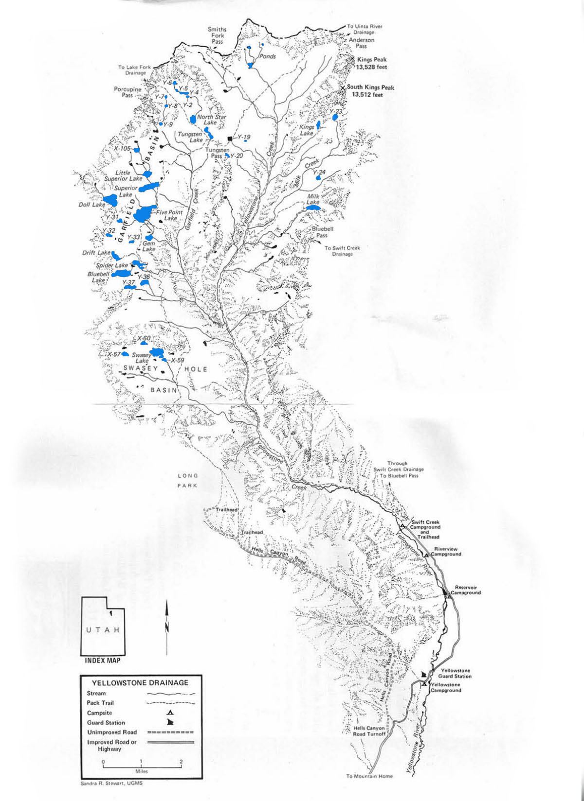

# Yellowstone River Drainage

The Yellowstone River Drainage is centrally located within the Uinta Mountains. The majority of the drainage's lakes and ponds are located long its west end. There are few fishable lakes along the east end. The drainage is sub-divided into three basins. These include the Garfield, Swasey Hole, and Tungsten Lake group basins.

The yellowstone river flows through the glacial formed valleys while most of the drainage's lakes are located on the surrounding high mountain plateus. Like most of the drainages, the terrain in the Yellostone River Drainage is steep and rocky.

There are two routes into the Yellowstone River Drainage. These include (1) the Swift Creek trailhead at Swift Creek Campground and (2) the Hell's Canyon trailhead at the bottom of Long Park. The Swift Creek trailhead is located about 4 miles north of the U.S. Forest Service Guard Station on Yellowstone River Road. The Hell's Canyon trailhead is 7 miles up Hell's Canyon Road from the junction between Hell's Canyon Road and Yellowstone River Road. Both trails are well-maintained for foot and horse access.

Five Point Reservoir, Swasey Lake, Gem Lake, X-59 Lake and Spider Lake receive the most fishing pressure. The remaining lakes scattered throughout the drainage are much more inaccessible and receive little foot traffic or fishing pressure.

There are about 20 lakes in the Yellowstone River Drainage that are stocked periodically with Brook and Cutthroat trout. If you're lucky you may also hook a rainbow or two. Naturally reproducing populations of brook trouts are found in several lakes including Doll, Bluebell, and Y-31 lakes. You'll also find brookies and cutthroats throughout the drainage's streams.

## Lakes

| Lake name | Size (acres) | Max depth (ft) | Fish species | Fishing pressure |
|-----------|--------------|----------------|--------------|------------------|
| Bluebell, X-10 | 38.3 | 32 | Brook and cutthroat trout (naturally reproducing) | Moderate |
| Doll, Y-16 | 42.5 | 47 | Brook trout | Low |
| Drift Reservoir, Y-41 | 14.8 | Unknown | Brook trout | Low |
| Five Point Reservoir, X-106 | 82 | 21 | Brook and cutthroat trout | Moderate |
| Gem, Y-34 | 11.1 | 15 | Brook trout (naturally reproducing) | Moderate |
| Kings, Y-22 | 10 | Unknown | Cutthroat trout | Low |
| Little Superior, X-104 | 13.9 | 24 | Brook trout | Low |
| Milk, Y-25 | 17.5 | 20 | Brook trout | Low |
| North Star, X-108 | 14 | 15 | Brook trout (naturally reproducing) | Moderate |
| Spider, X-109 | 20 | 31 | Brook and cutthroat trout | High |
| Superior, X-103 | 36 | 26 | Brook trout (naturally reproducing) | Moderate |
| Swasey, X-58 | 36 | 30 | Brook and cutthroat trout (naturally reproducing) | High |
| Tungsten, X-107 | 13 | 13 | Brook and cutthroat trout | Moderate |
| X-57 | 8.8 | 30 | Brook trout (naturally reproducing) | Low |
| X-59 | 4.5 | 13 | Brook and cutthroat trout | Moderate |
| X-60 | 8 | 30 | Cutthroat trout (stocked) | Low |
| X-105 | 8.1 | 14 | Cutthroat trout | Low |
| Y-2 | 1.8 | 20 | Brook trout (naturally reproducing) | Low |
| Y-4 | 5.8 | 12 | Brook trout (naturally reproducing) | Low |
| Y-5 | 1.8 | 6 | Brook trout (naturally reproducing) | Low |
| Y-19 | 6.2 | 15 | Brook trout | Low |
| Y-20 | 5 | 20 | Arctic grayling | Low |
| Y-31 | 4.6 | 7 | Brook trout (naturally reproducing) | Moderate |
| Y-36 | 14 | 15 | Brook trout | Low |
| Y-37 | 13 | 12 | Brook trout | Low |