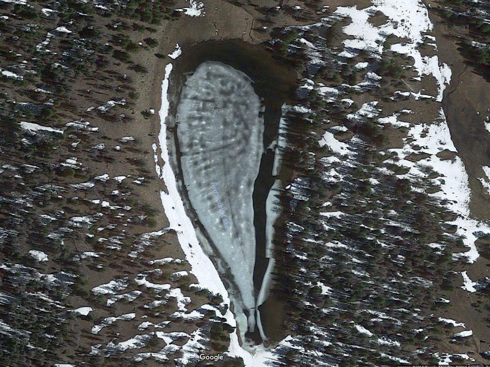

# Bedground Lake (Z-46)

## Location
Bedground Lake also known as Z-46 is located in Duchesne County, Utah and is part of the Grandaddy Basin of the Uintas.

## Fish Species
The Utah fish stocking reports show mostly Arctic Grayling being stocked here.

## Other Info
You can read more about the area on [CordellMandersen.com](http://www.cordellmandersen.com/2010/06/trip-1-2010-grandaddy-basin-and-lessons.html). Bedground Lake is shaped like an upside down tear drop.

## Historical DWR Info
This lake is a small meadow pond located east of the trail between Rainbow Lake and Four Lakes Basin. It is 2.0 acres,10,500 feet in elevation, with 15 feet maximum depth. The lake lies 10.0 miles from the Upper Stillwater Trailhead and 8.9 miles from Mirror Lake or the Grandview Trailhead. Excellent campsites and horse feed are available, however, there is no spring water. Bedground is stocked with brook trout. In the past, it has been known to produce some fairly large fish. Fishing pressure is moderate.

## Nearby Areas to Fish
Allen Lake, Daynes Lake, Dale Lake, Jean Lake, Dean Lake, Pinto Lake, Governer Dern Lake, Jeff Lake, Rainbow Lake, Range Lake.

## Photos
