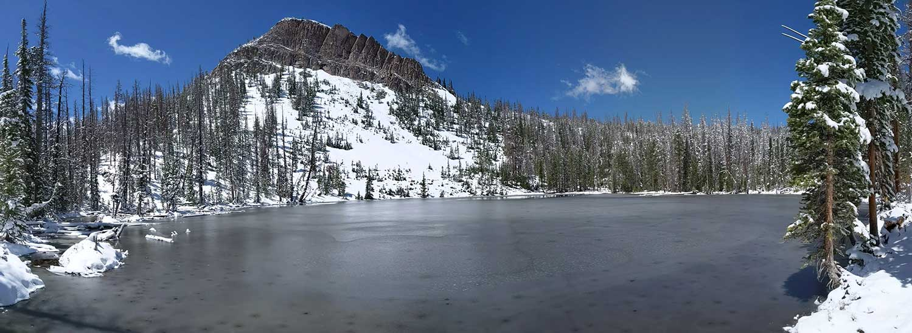
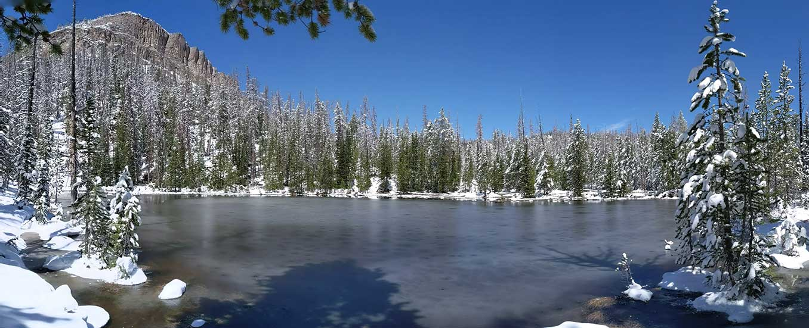
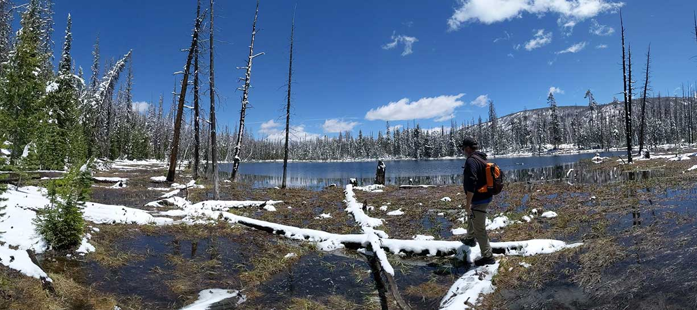

# Bourbon Lake (BR-1/Gold Hill)

## Location
Bourbon Lake, also known as BR-1 and Gold Hill, is located in Summit County, Utah, in the Bear River drainage of the Uinta Mountains. The lake sits at an elevation of 9,820 feet and covers 1.9 acres with a maximum depth of 8 feet.

## Fish Species
Bourbon Lake is stocked with:
- Brook Trout (stocked every 4 years: 2012, 2016, 2020)
- Approximately 200 fish per stocking, average size 2.5 inches

## Other Info
Bourbon Lake is described as a picturesque, crescent-shaped lake with clear water and wary brook trout. The area includes nearby lakes BR-2 and BR-50, which are also stocked with brook trout on similar cycles.

## Historical DWR Info
This small alpine lake provides excellent brook trout fishing for those willing to make the hike. The clear water makes the fish somewhat wary, requiring careful presentation and stealth.

## Access/Directions
- Trailhead: Whiskey Creek Trail, located across from Sulphur Campground on Mirror Lake Highway
- Hike Distance: 2.8 miles round trip
- Elevation Gain: 680 feet
- Difficulty: Moderate

## Nearby Areas to Fish
Whiskey Island Lake, Whitney Reservoir, Beaver Lake, Fish Lake, Round Lake, Ruth Lake, Hayden Lake, Cutthroat Lake, Lily Lake, and nearby lakes BR-2 and BR-50.

## Photos

