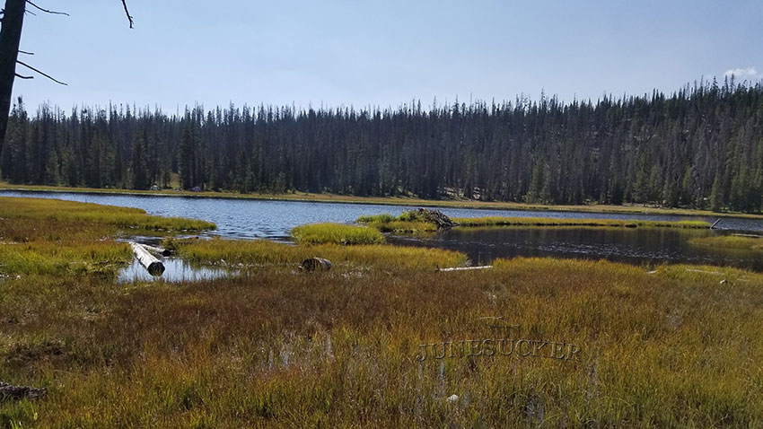

# Buckeye Lake (A-3)

## Location
Buckeye Lake, also known as A-3, is located in Summit County, Utah at an elevation of 9,660 feet. The lake covers 5 acres with a maximum depth of 8 feet.

## Fish Species
Buckeye Lake is stocked with:
- Brook Trout (stocked approximately every three years)

## Other Info
Buckeye Lake is a shallow, productive lake characterized by floating, grass-covered banks and islands. It is surrounded by wet meadow and conifer perimeter. The lake was named by Abram Jones, a sheep herder for the Lambert family. The nearby Lambert Meadows were named after the local grazing operation.

## Historical DWR Info
This small, shallow lake provides good brook trout fishing. The lake's productivity is enhanced by its shallow depth and nutrient-rich environment created by the surrounding wet meadow ecosystem.

## Access/Directions
Two primary access routes are available:
1. From Alexander Lake turnoff on Mirror Lake Highway
2. From Trial Lake turnoff on Mirror Lake Highway

Follow Forest Road 041 (Spring Canyon Road) to reach the lake. The western side of the lake provides easier access.

## Nearby Areas to Fish
Spectacle Lake, Blue Lake, Lambert Lake, Alexander Lake, Trident Lake, and several other alpine lakes in the area.

## Photos
