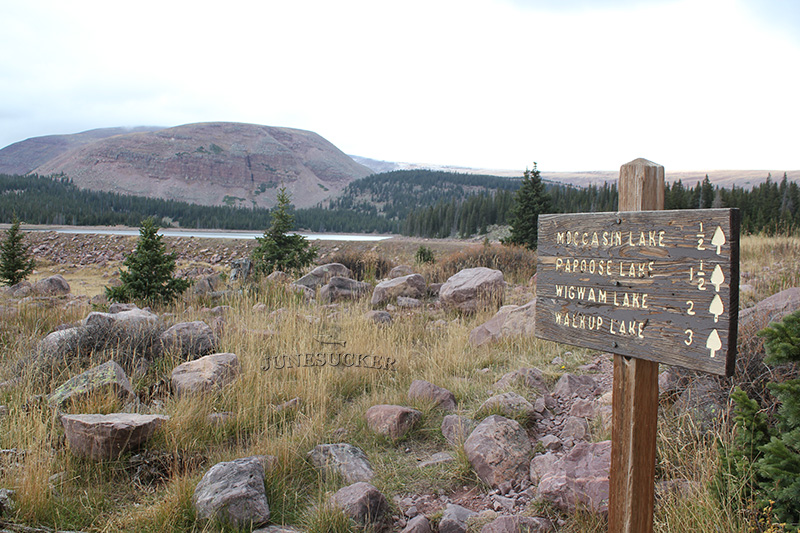
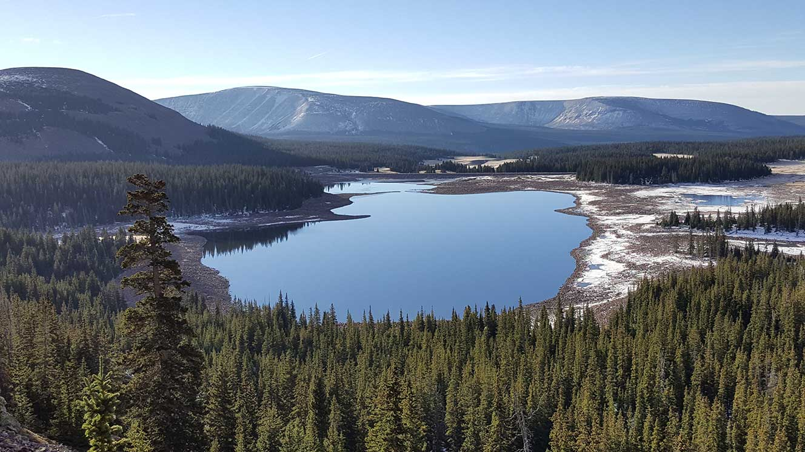

# Chepeta Lake (WR-64)

## Location
Chepeta Lake, also known as WR-64, is located in Duchesne County, Utah at an elevation of 10,600 feet. The lake has a maximum surface area of 50 acres and reaches a maximum depth of 60 feet.

## Fish Species
Chepeta Lake is stocked with:
- Brook Trout (cyclically stocked)
- Rainbow Trout

## Other Info
Chepeta Lake is named after Native American princess Chipeta. The lake offers excellent campsites with plenty of horse feed, though it experiences heavy fishing pressure due to its popularity and fish quality.

## Historical DWR Info
This high-elevation lake is known for producing quality trout. The cyclical stocking program helps maintain healthy fish populations while managing pressure on wild fish stocks.

## Access/Directions
1. From Roosevelt, take US 40 to Eagle View Elementary School
2. Turn east onto White Rocks Highway/5750 East
3. Follow road (becomes Farm Creek Road) for 20 miles
4. Turn onto FR117/Elkhorn Loop
5. Follow 14 miles to Chepeta Lake fork
6. Turn right, follow 10 more miles
7. Parking is located 200 yards from the lake

## Nearby Areas to Fish
Whiterocks River, Moccasin Lake, Wigwam Reservoir, Papoose Lake, and over 20 additional nearby lakes and waters in the White Rocks drainage system.

## Photos

