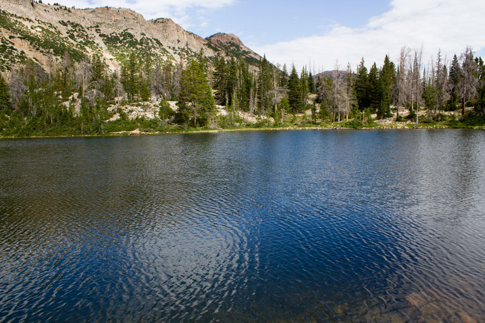
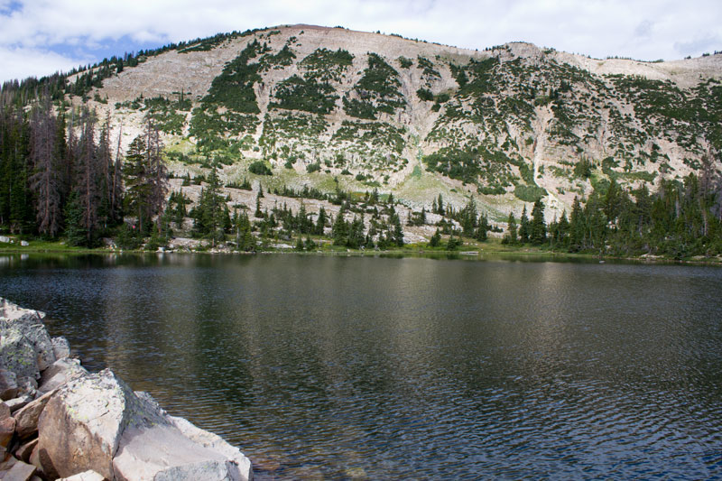

# Cutthroat Lake (BR-37)

## Location
Cutthroat Lake, also known as BR-37, is located in Summit County within the Uinta-Wasatch-Cache National Forest at an elevation of 10,400 feet. The lake covers 5 acres with a maximum depth of 16 feet and average depth of 13 feet.

## Fish Species
Cutthroat Lake is stocked with:
- Cutthroat Trout
- Tiger Trout

## Other Info
Cutthroat Lake is described as a heart-shaped lake set in a rugged mountain environment. The lake's remote location and lack of direct trails make it a destination for more adventurous anglers seeking solitude and pristine fishing conditions.

## Historical DWR Info
This remote alpine lake is stocked with cutthroat trout and provides excellent fishing for those willing to make the challenging hike. The lake's isolation helps maintain quality fishing with less pressure than more accessible waters.

## Access/Directions
- Quickest route: Hike to Ruth Lake, then proceed northwest towards Jewel Lake
- No direct trail to the lake - GPS navigation recommended
- Alternative access via Lofty Lake Loop Trail (longer route)
- Challenging hike requiring good navigation skills

## Nearby Areas to Fish
Teal Lake, Cuberant Lake, Jewel Lake, Hayden Lake, Naomi Lake, Ruth Lake, Kamas Lake, Scout Lake.

## Photos

