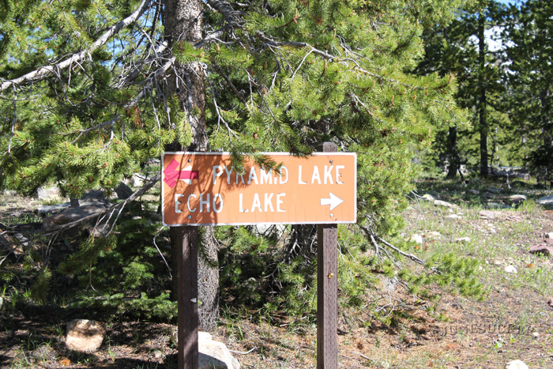

# Echo Lake (Z-16)

## Location
Echo Lake, also known as Z-16, is located in the Uinta-Wasatch-Cache National Forest, Utah at an elevation of 9,740 feet. The lake covers 18 acres with a maximum depth of 44 feet.

## Fish Species
Echo Lake is stocked with:
- Brook Trout
- Golden Trout

## Other Info
Echo Lake is situated in thick conifers at the base of a talus slope and receives heavy recreational use. The lake offers campsites with spring water available at the southeastern end, though horse feed is limited in the area.

## Historical DWR Info
Echo Lake is known for its golden trout population, making it a unique fishing destination in the Uintas. The combination of brook trout and golden trout provides diverse angling opportunities for visitors willing to navigate the challenging access road.

## Access/Directions
- Take Mirror Lake Highway to Murdock Basin exit
- Follow Murdock Basin Road (Road 137)
- Requires 4-wheel drive vehicle with high clearance
- Rough road conditions - GPS recommended
- Not suitable for standard passenger vehicles

## Nearby Areas to Fish
Pyramid Lake, Joan Lake, Gem Lake, Blizzard Lake, Marshall Lake, Hoover Lake, Shepard Lake, Lost Lake.

## Photos

