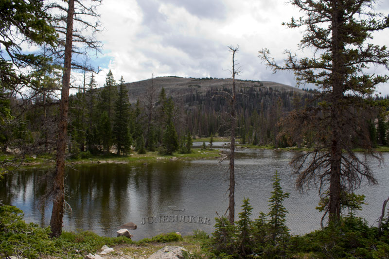

# Hayden Lake (BR-36)

## Location
Hayden Lake is located in Summit County, Utah, within the Bear River Drainage of the Uinta-Wasatch-Cache National Forest. The lake is accessible via a 45-minute hike from the Mirror Lake Highway, with parking at the Ruth Lake trailhead.

## Fish Species
Hayden Lake is stocked with:
- Cutthroat Trout (pre-2008)
- Tiger Trout (introduced by DWR in 2008, typically planted every other year)

## Other Info
Hayden Lake is named after Ferdinand Vandeveer Hayden, an explorer, geologist, physician, and professor who surveyed the Uinta Mountains around 1871. Hayden was instrumental in establishing Yellowstone National Park, making this lake a tribute to an important figure in American conservation history.

## Historical DWR Info
The lake underwent a species transition in 2008 when the Utah Division of Wildlife Resources introduced tiger trout to replace the previous cutthroat trout population. Tiger trout stocking typically occurs every other year to maintain healthy fish populations.

## Access/Directions
- Park at Ruth Lake trailhead off Mirror Lake Highway (UT-150)
- Hike approximately 45 minutes from parking area
- Moderate difficulty trail
- Follow established trail markers

## Nearby Areas to Fish
Ruth Lake, Naomi Lake, Jewel Lake, Cutthroat Lake, Lofty Lake, Kamas Lake, Scout Lake.

## Photos
