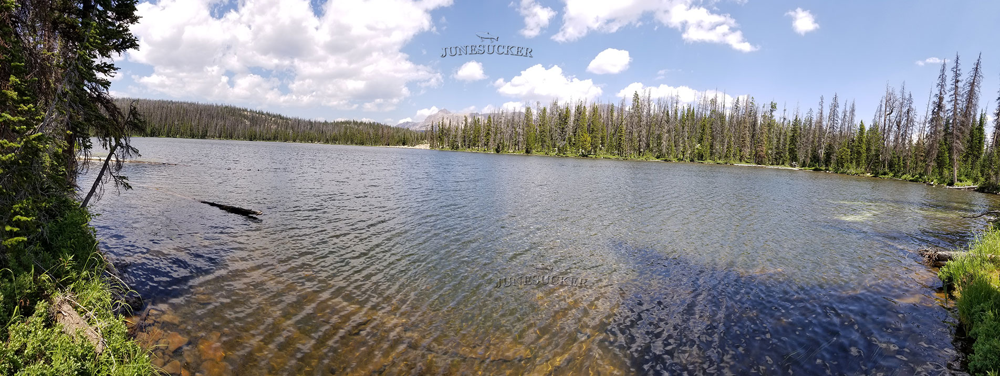

# Hoover Lake (Z-10)

## Location
Hoover Lake, also known as Z-10, is located in the northwest corner of Duchesne County, Utah at an elevation of 9,900 feet. The lake covers 18.6 acres with a maximum depth of 28 feet and is part of the Uinta-Wasatch-Cache National Forest.

## Fish Species
Hoover Lake is stocked with:
- Brook Trout (stocked periodically)
- Potentially a few Cutthroat Trout

## Other Info
Hoover Lake is a natural lake surrounded by conifers with multiple shoreline access points. The lake has a piped spring water source and experiences heavy fishing pressure. Horse feed is limited in the area.

## Historical DWR Info
This popular lake receives periodic brook trout stocking to maintain fishable populations. The lake's accessibility and consistent fishing make it a heavily pressured but productive fishing destination.

## Access/Directions
- Access via Murdock Basin Road, approximately 8.5 miles from Mirror Lake Highway
- Recommended transportation: 4-wheeler or high-clearance vehicle
- GPS navigation recommended due to potentially damaged or missing road signs
- Not suitable for standard passenger vehicles

## Nearby Areas to Fish
Maba Lake, Shepard Lake, Marshall Lake, Fehr Lake, Echo Lake, Pyramid Lake, Gem Lake, Joan Lake, Blizzard Lake.

## Photos
