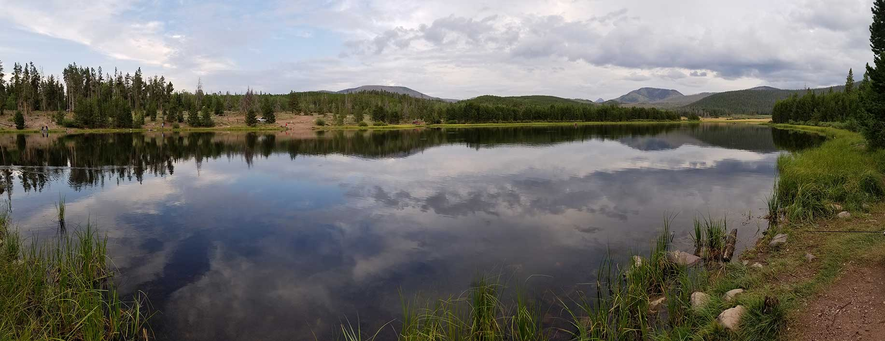
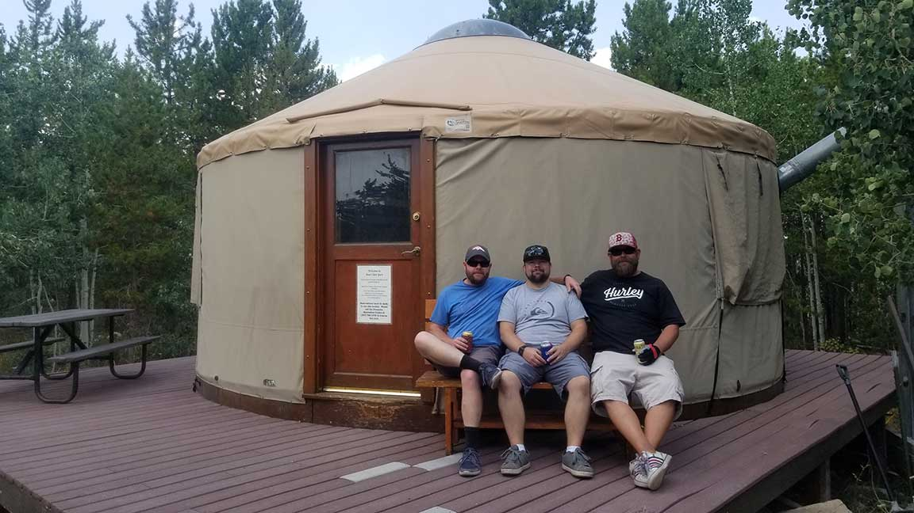

# Lily Lake (BR-11)

## Location
Lily Lake BR-11 is located in Summit County, Utah, within the Uinta-Wasatch-Cache National Forest in the Bear River drainage system.

## Fish Species
Lily Lake is stocked with:
- Rainbow Trout (stocked 3 times annually)
- Previously had Tiger Trout (stocked in 2010, no longer present)

## Other Info
Lily Lake offers excellent camping opportunities with multiple camping areas around the lake. The area features 5 nearby yurts available year-round for rental at approximately $75/night. These yurts are equipped with bunks, stove, fireplace, and utensils, making them ideal for winter access when the area is only accessible by snowmobile or snowshoe.

## Historical DWR Info
This lake provides consistent rainbow trout fishing with regular stocking throughout the season. The lake was previously part of experimental tiger trout stocking programs.

## Access/Directions
- Access via Forest Roads 343 and 120
- Turn-off is located north of Christmas Meadows on UT-150 Mirror Lake Highway
- 1.2 miles south of Bear River Lodge
- Accessible by vehicle in summer
- Winter access via snowmobile or snowshoe only
- Multiple 4-wheeling/skiing trails with trail markers and maps
- Note: "Deadman Traverse" trail not recommended for vehicles

## Nearby Areas to Fish
East Fork Bear River, Scow Lake, Baker Lake, Lorena Lake, Whitney Reservoir, Elizabeth Lake.

## Photos

