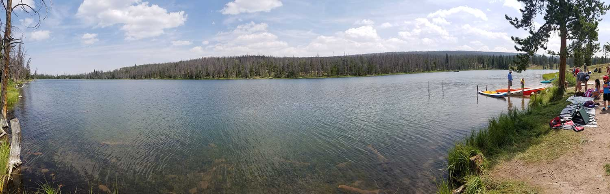

# Marsh Lake G-19

## Directions
Marsh Lake G-19 is located in Summit County, Utah. The lake lies within the Wasatch-Cache National Forest, and is part of the Smith Fork Drainage.

From Salt Lake City the fastest route is to take I80 highway to Fort Bridger, Wyoming. Head south to Mountain View and take the road WY-410 for 24 miles south. Stateline Reservoir is a around 2 miles before Marsh Lake G19 on the same road.

Alternatively you can enter from Mirror Lake Highway. Near the Bear River Campground take Forest Road 58 east for 19 miles. Take the turn off to Forest Road 073 and follow it east for a little over 16 miles. This is a dirt road which is usually decent enough to take a car on in the summer time.

## Fish Species
Marsh Lake G-19 is stocked with around 5,000 rainbow trout a year. In the 1980's, and 1990's, the lake was stocked with albino rainbow trout. Up until the early 1980's, the lake was stocked with brook trout. The lake can experience winter kills.

## Camping and Other Info
There is a camping at the lake in the West Marsh Lake Campground. There is 40 single camping sites, and 6 double camping sites. You can book a camping site from [Recreation.gov](https://www.recreation.gov/camping/campgrounds/232071). There is a small boat ramp for launching boats at the campground.

Other nearby camping sites include Bridger Lake Campground, China Meadows Campground, and Stateline Campground.

In 2010 the Forest Service cut down most of the trees in the area to try and get rid of pine beetles.

## Hiking Nearby
Marsh Lake Campground to Hessie Lake is a 16 mile round trip trail. [Alltrails](https://www.alltrails.com/trail/us/utah/marsh-lake-campground-to-hessie-lake) has the best write up on this adventure. Hessie Lake is stocked on a 2 year tiger trout cycle, and has a possible catch of brook trout. Nearby fishing at Hessie Lake includes G-58 naturally producing cutthroat trout. G-60 stocked with tiger trout in 2018, and brook trout in 2009. G-61 stocked every 2 to 3 years with brook trout. G-56 stocked with brook trout on 3 year cycle.

From the nearby China Meadows area you can take the [Red Castle Lake and Kings Peak Loop](https://www.alltrails.com/trail/us/utah/red-castle-lake-and-king-s-peak-loop-from-china-meadows).

## Historical Information

### 1964 DWR Pamphlet
MARSH, G-19. 33 acres, elevation 9,350 feet, maximum depth 33 feet, average depth 11 feet. Reservoir with 4 foot fluctuation. Accessible by road some 25 miles west and south of Mountain View, Wyoming. Timbered terrain. Excellent Forest Service campgrounds. Heavy fishing pressure on weekends and holidays. This area is a popular "take off" point into the high lakes. Both brook and rainbow trout. Stocked with catch-able rainbows and fingerling brook. No resort accommodations available. Very good fly fishing areas.

### 1986 DWR Pamphlet
MARSH G-19. Marsh is an elongated reservoired lake located in dense timber in the lower Smith Fork Basin. It is 33.6 acres maximum, 9,335 feet in elevation with 35-foot maximum depth. The annual water level fluctuation at this reservoir is about 4 feet. Marsh is accessible on an improved Forest Service road, 26 miles south of Mountain View, Wyoming. There are 2 Forest Service campgrounds developed at Marsh with a combined capacity of 3 units. Marsh Lake experiences heavy fishing and camping activity, particularly on weekends. Marsh Lake is stocked with rainbow and albino rainbow catchables on a regular basis during the summer months. Stocking of brook trout fingerling ha been presently discontinued due to winterkil1 problems. The Forest Service has installed a water circulator at Marsh in an attempt to increase oxygen concentrations and improve winter survival of fish.

### Utah 2000 Lake Report
The Utah Division of Water Quality put out a report on the lake in the year 2000. In the report they incorrectly claim that Marsh Lake was treated with Rotenone in 1954. The lake that was treated for rough fish using Rotenone in 1954 was located in Sevier County, and not in the Uintas.

## Nearby Places To Fish
East Fork Smiths Fork river runs just to the west of Marsh Lake G-19. There is a beaver pond a half mile north of Marsh called G-30 which was stocked with brook trout in the 1960's. In the 1980's the DWR claimed that G-30 didn't sustain life and no longer stocked it. G-29 is another beaver pond which is located west of the turn off to Bridger Lake. G-29 was also stocked by with brook trout in the 1960's and then later ceased. Bridger Lake is located 2.5 miles to north west. Bridger is stocked frequently with brook and rainbow. Stateline Reservoir is located about a mile to the north. China Lake is located south west of marsh and can be accessed by hiking from the trailhead at china meadows. China Lake is stocked with brook trout and arctic grayling. The graying from china lake are known to swim up the Smith Fork river near marsh.

## Were You Looking for?
In typical Uintas fashion there is another lake named Marsh. This is why they designate the drainage and lake number to avoid confusion. In the Ashley Creek drainage there is Marsh Lake GR-39. This lake is stocked with golden trout, rainbow trout and brook trout. GR-39 had the Utah state record for golden trout in 2019.

## Lake Details
- **Size**: 33.6 acres
- **Elevation**: 9,335 feet
- **Maximum Depth**: 35 feet
- **Average Depth**: 11 feet
- **Water Level**: 4-foot annual fluctuation
- **Classification**: Reservoir
- **Access**: Improved Forest Service road from Mountain View, WY or Mirror Lake Highway
- **Camping**: West Marsh Lake Campground (40 single, 6 double sites)
- **Facilities**: Boat ramp, water circulator system
- **Pressure**: Heavy on weekends and holidays