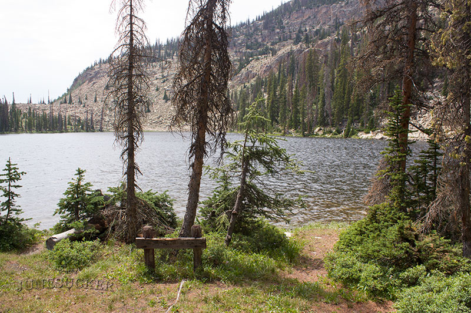
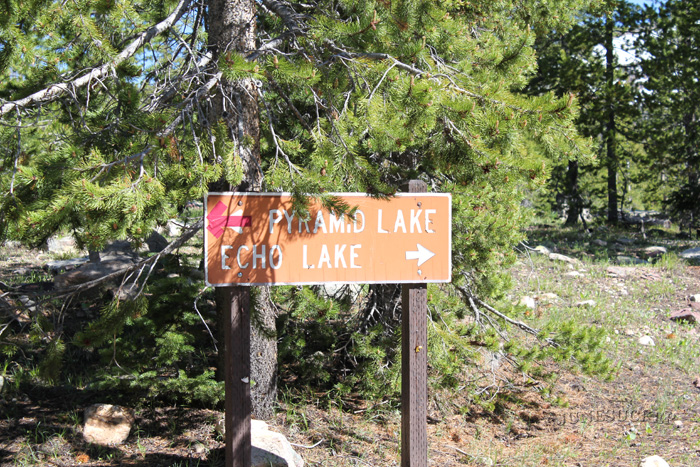

# Pyramid Lake (Z-17)

## Location
Pyramid Lake also known as Z-17 is located on the northwest boarder of Duchesne County, Utah The Lake is part of the Uinta-Wasatch-Cache National Forest, and is part of the Duchesne Drainage area of the Uintas. From the Mirror Lake highway take the Murdock Basin exit. Follow the Murdock Basin Road (road 137) about 5.5 miles up. Turn onto Forest Road 410 and drive a tenth of a mile until you see the sign for Echo Lake, and Pyramid. You will take the left turn towards Pyramid Lake. The road stops about 100 feet from the Lake. We highly recommend you take a vehicle with a high ground clearance. There road is littered with huge rocks. A 4 wheeler would be your best bet. Just past the turn off to FR-410 there is a river that runs across the road. If you hit that it means you missed the turn.

## Fish Species
Brook Trout

## Other Info
Most the people that head up this area are headed to Echo Lake. So Pyramid Lake can be a good place to get away from the crowds. The lake is triangle shaped which is how it received it's name.

## Historical DWR Info
Pyramid is an aesthetic natural lake situated at the base of a talus slope in the Murdock Basin Area. The lake is 15 acres, 9,700 feet in elevation, with 36 feet maximum depth. There are several campsites along the northeastern margin, but spring water is unavailable. Access is 5 1/4 miles north and east of U-l 50 on the Murdock Basin Road to the Echo Lake turnoff. Proceed north on this road to the first left-hand turn and then west for 3/8 mile. The accessibility of this water promotes heavy fishing pressure. Pyramid contains a population of brook trout.

## Video
KSL Outdoors did an episode on [Pyramid Lake](https://www.ksl.com/?sid=21274957).

## Nearby Areas to Fish
Echo Lake, Joan Lake, Blizzard Lake, Marshall Lake, Hoover Lake, Shepard Lake, and Maba Lake.

## Lake Details
- **Size**: 15 acres
- **Elevation**: 9,700 feet
- **Maximum Depth**: 36 feet
- **Classification**: Natural lake
- **Access**: Murdock Basin Road/Forest Road 410 (high clearance vehicle recommended, 4WV preferred)
- **Camping**: Several campsites on northeastern margin (no spring water)
- **Pressure**: Heavy fishing pressure due to accessibility
- **Shape**: Triangle-shaped (hence the name)