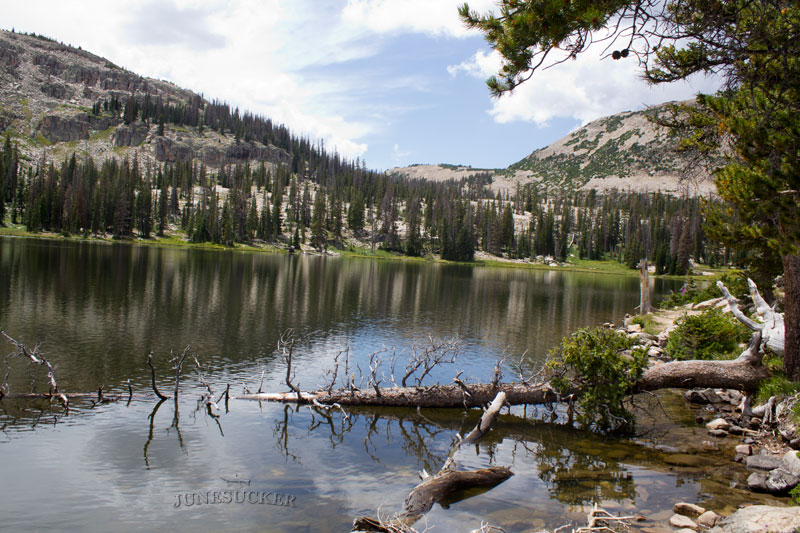
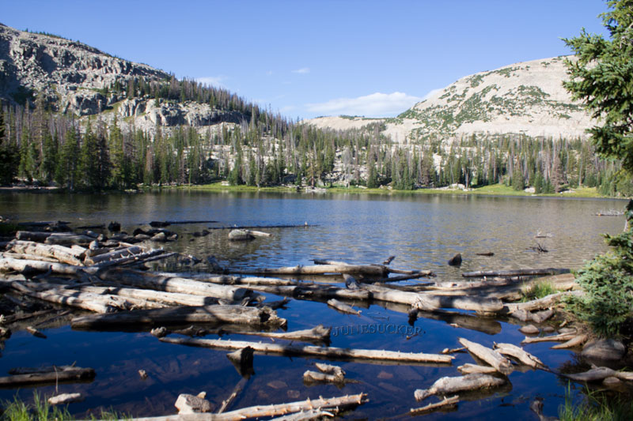

# Ruth Lake (BR-40)

## Location
Ruth Lake, also known as BR-40, is located in Summit County within the Uinta-Wasatch-Cache National Forest at an elevation of 10,500 feet. The lake covers 10 acres with a maximum depth of 31 feet and an average depth of 11 feet.

## Fish Species
Ruth Lake is stocked with:
- Brook Trout (stocked regularly)

## Other Info
Ruth Lake serves as a popular destination and trailhead for accessing other high-elevation lakes in the area. The lake has convenient parking facilities with two parking lots near restrooms, making it one of the more accessible alpine fishing destinations.

## Historical DWR Info
This well-maintained lake receives regular brook trout stocking and provides consistent fishing opportunities. The lake's accessibility and regular stocking make it a popular choice for families and less experienced hikers.

## Access/Directions
- Located off Mirror Lake Highway (UT-150)
- Two parking lots available near restrooms
- Approximately 0.7-mile trail to lake
- Trail difficulty rated as "moderate to difficult" though many find it manageable
- Well-marked trail with good access

## Nearby Areas to Fish
Naomi Lake, Hayden Lake, Jewel Lake, Cutthroat Lake, Lofty Lake, Kamas Lake, Teal Lake, Cuberant Lake, Scout Lake, Picturesque Lake.

## Photos

