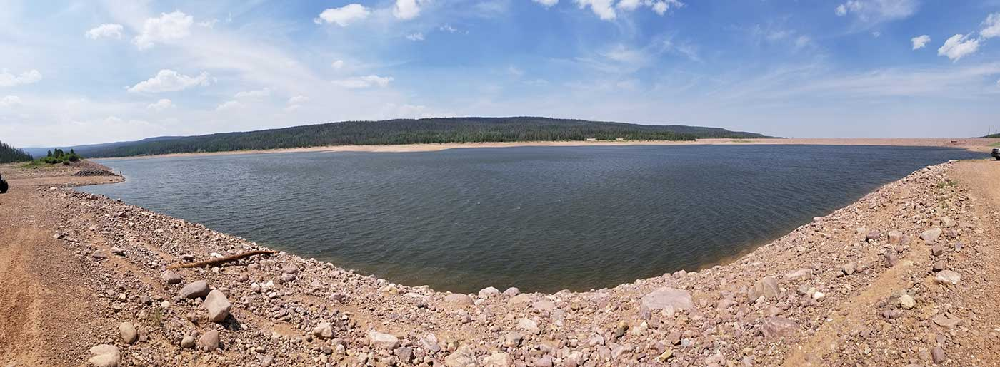

# Stateline Reservoir

## Directions
Stateline Reservoir is located in the Smith Fork Drainage of the Uinta Mountains. The lake lies within Summit County, of Utah. From Salt Lake City the fastest route is to take I80 highway to Fort Bridger, Wyoming. Head south to Mountain View and take the road WY-410 for 22 miles south. You will see signs for the lake.

Alternatively you can enter from Mirror Lake Highway. Near the Bear River Campground take Forest Road 58 east for 19 miles. Take the turn off to Forest Road 073 and follow it east for a little over 16 miles. This is a dirt road which is usually decent enough to take a car on in the summer time.

## Fish Species
Each year around 10,000 rainbow trout are stocked.

In 2020 for the first time 3,800 lake trout were stocked. The lake trout are sterile. The hope is that they will control the kokanee salmon population. Every 3 to 4 years the kokanee salmon number explode. The explosion in numbers then causes a crash from over population. The hope is if the population can stabilize which should create bigger fish.

In 2006, 5,880 brook trout were stocked. There is a really small population of Arctic Grayling that have made their way up from China Lake. There is a bigger population of Grayling just south of the reservoir in the east fork of Smith Fork river.

Salmon Kokanee fry was introduced to Stateline Reservoir in 1992. The same year as Causey Reservoir. Kokanee in Utah lay on average 1000 eggs per female. During spawning in the wild the female kokanee will pick her nest which is called a redds. The female kokanee will create multiple redd's and lay eggs in each. The male kokanee will then fertilize the eggs, and then guard the redd's from other males or predators. Often times multiple male's can fertilize the eggs. The kokanee spawn in the east fork of the Smith Fork River typically around the middle of September.

## Other Info
The [Stateline Campground](https://www.recreation.gov/camping/campgrounds/232104) has 41 improved campsites. Each site costs $22 a night. There are restrooms in the campground. There are several additional campsites available nearby as well.

It is against the law for anglers to possess Kokanee Salmon at any Utah water body from September 10th through November 30th.

The boat ramp can be somewhat shallow and may be difficult for bigger boats. Fishing from shore can be difficult so boat fishing here is recommended.

## History
**1956** The [Lyman Project](https://www.usbr.gov/projects/index.php?id=353) was created to assist with water issues in the Bridger Valley of Wyoming. As part of this project Meeks Cabin Reservoir was constructed in 1971.

**1972** China Meadows Reservoir was proposed but rejected due to environmental concerns. The area was popular for big game and would destroy the trail head to Red Castle lakes and to Kings Peak.

**1975** The location for Stateline Reservoir was chosen to take the place of China Meadows Reservoir. Environmental impact studies were carried out, and were seen as favorable.

**1976** An $11,062,555 construction contract was awarded to S. J. Groves and Sons Co. of El Cajon, California. The contract called for construction of a rolled earthfill dam approximately 2,800 feet long at the crest. It also called for construction of two small dikes, a spillway consisting of a glory hole inlet structure, control house, and stilling basin.

**1976** The Department of the Interior published in the Federal Register a Public Land Order withdrawing 710 acres of national forest land, for the dam and reservoir.

**1977** Construction on the dam begins

**1979** Dam construction is completed. Filling the reservoir begins but is halted due to insufficient runoff. Filling the dam continues in the spring of 1980. Brook, cutthroat and rainbow trout are planted for 2 years.

**1980** President carter asks for 100 million dollars for water projects. One of the pieces of the project is to add recreation facilities at Stateline Reservoir.

**1981** The reservoir is filled and begins to pour over the spillway.

**1992** Kokanee are planted for the first time.

**2020** Lake trout are planted for the first time.

## Fishing Regulations
Updated for the 2024 season.

- Limit 4 trout or kokanee salmon, and no more than 1 may be a lake trout over 22 inches.
- All lake trout 22 inches or smaller must be immediately released.
- Bonus limit of 4 kokanee salmon (total limit of no more than 8 trout if at least 4 are kokanee salmon).

## Nearby Places to Fish
East Fork Smith Fork, Bridger Lake, Marsh Lake, and China Lake.

## Lake Details
- **Classification**: Reservoir (part of Lyman Project)
- **Access**: WY-410 from Mountain View, WY or Forest Road 58/073 from Mirror Lake Highway
- **Camping**: Stateline Campground (41 sites at $22/night)
- **Facilities**: Boat ramp (shallow), restrooms
- **Construction**: 1976-1979, filled 1980-1981
- **Dam**: 2,800 feet long earthfill dam
- **Special Notes**: Kokanee spawning closure Sept 10-Nov 30