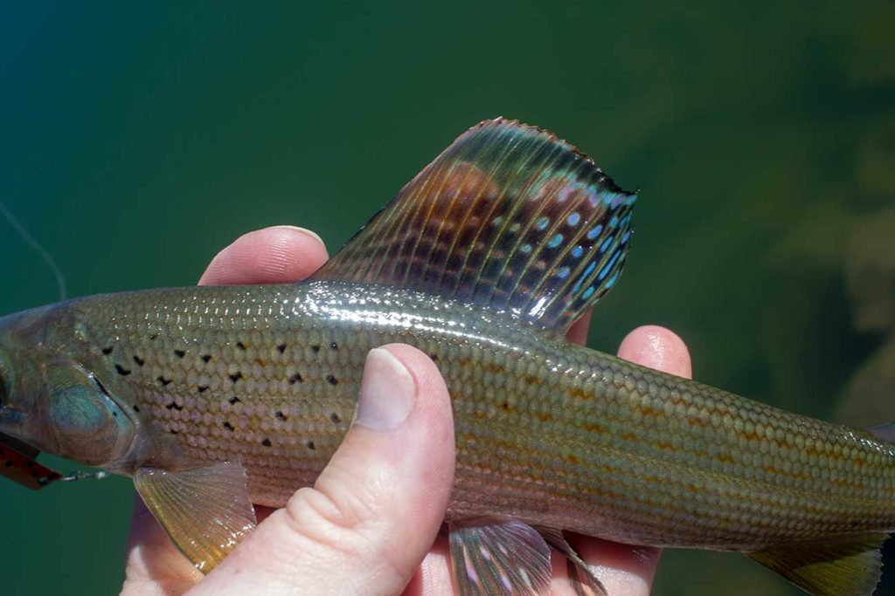

# Whiskey Island Lake (Guys Lake/BR-3)

## Location
Whiskey Island Lake, also known as Guys Lake, is located in Summit County, Utah at an elevation of 10,200-10,400 feet. The lake covers 5 acres with a maximum depth of 19 feet.

## Fish Species
Whiskey Island Lake is known for:
- Arctic Grayling (naturally reproducing population)
- Regular stocking by Utah Division of Wildlife Resources
- Historical significance: 1990 state record Arctic Grayling was caught here (1lb 4oz, 15 1/4" long)

## Other Info
Whiskey Island Lake is subject to winterkill but has been part of experimental Arctic Grayling stocking programs. The lake supports a naturally reproducing population of Arctic Grayling, making it a unique fishing destination in Utah.

## Historical DWR Info
This high-elevation lake has been an important location for Arctic Grayling conservation efforts. Despite occasional winterkill events, the lake has maintained viable grayling populations through natural reproduction and supplemental stocking.

## Access/Directions
- Access from Mirror Lake Highway via Forest Road 110
- Hiking distance: Over 2 miles total
- Recommended: High clearance vehicle for first 1.6 miles
- The hiking route involves 4 legs with significant elevation changes
- Challenging access but rewarding fishing experience

## Nearby Areas to Fish
Bourbon Lake, Fish Lake, Sand Lake, Round Lake, Cuberant Lake, Teal Lake, Cutthroat Lake, Hayden Lake, Ruth Lake, Whitney Reservoir.

## Photos
