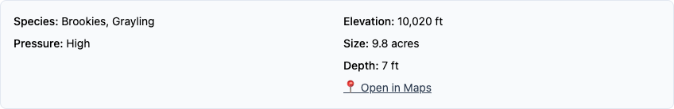

# A-51 Crystal: wild Grayling shown as present (no asterisk)

*2026-08-29T23:01:18Z by Showboat 0.6.1*
<!-- showboat-id: 93f945ce-6878-4889-920e-010150d145dc -->

Jed has caught hundreds of Arctic Grayling in **Crystal Lake A-51** (Provo River
Drainage). Grayling were never stocked there — the population is wild and
self-sustaining — so the species was missing from the app, and naively adding it
to `lakes.fish_species` would have been re-rendered as historical ("Grayling\*")
by the `refresh_all_fish_species` sweep that every stocking cron runs.

**The fix:** a curated `WILD_SPECIES` map in `scripts/species_utils.py`
(`{'A-51': {'Grayling'}}`). `update_lake_fish_species` unions the lake's wild
set into the species list and exempts it from the asterisk logic, so the entry
survives every future sweep *without* an asterisk.

**Before values** (captured 2026-08-29, pre-change, via
`sqlite3 uinta_lakes.db "SELECT letter_number, fish_species, last_modified FROM lakes WHERE letter_number IN ('A-51','GR-128')"`):

    A-51|Brookies|2026-08-25 14:00:11
    GR-128|Brookies*, Cutthroats*|2026-08-25 14:00:11

GR-128 Crystal (Burnt Fork Drainage — a *different* Crystal Lake) must remain
byte-identical; block 2 proves its full row still hashes the same as the
committed DB in git.

To re-run: repo root on this machine; node with the global `playwright-cli`;
port 8871 free (the browser blocks start and stop their own
`python3 -m http.server 8871`).

## 1. Source sanity: the WILD_SPECIES mechanism landed

```bash
grep -n 'WILD_SPECIES\|wild_species' scripts/species_utils.py
```

```output
17:WILD_SPECIES = {
140:    wild_species = WILD_SPECIES.get(letter_number, set())
172:    all_species = current_species.union(stocking_species).union(wild_species)
176:    asterisk_species = all_species - recent_stocking_species - wild_species
```

## 2. DB after-values: A-51 gains Grayling (no asterisk); GR-128 byte-identical to the committed DB

```bash

set -e
after_a51=$(sqlite3 uinta_lakes.db "SELECT fish_species FROM lakes WHERE letter_number='A-51'")
echo "A-51 fish_species now: $after_a51"
test "$after_a51" = 'Brookies, Grayling'
sqlite3 uinta_lakes.db "SELECT 'GR-128 live: '||fish_species||' | last_modified '||last_modified FROM lakes WHERE letter_number='GR-128'"
tmp=$(mktemp -d)
git show HEAD:uinta_lakes.db > "$tmp/head.db"
live=$(sqlite3 uinta_lakes.db -cmd '.mode quote' "SELECT * FROM lakes WHERE letter_number='GR-128'" | shasum -a 256 | cut -d' ' -f1)
head_=$(sqlite3 "$tmp/head.db" -cmd '.mode quote' "SELECT * FROM lakes WHERE letter_number='GR-128'" | shasum -a 256 | cut -d' ' -f1)
rm -rf "$tmp"
echo "GR-128 full-row sha256 (live DB):      $live"
echo "GR-128 full-row sha256 (committed DB): $head_"
test "$live" = "$head_" && echo 'GR-128: full row byte-identical to the committed DB — untouched'

```

```output
A-51 fish_species now: Brookies, Grayling
GR-128 live: Brookies*, Cutthroats* | last_modified 2026-08-25 14:00:11
GR-128 full-row sha256 (live DB):      a4b99d6b30abb4a26d1b24ec4636cc5bb2aeca7721eeff68dc169ed1f717f56a
GR-128 full-row sha256 (committed DB): a4b99d6b30abb4a26d1b24ec4636cc5bb2aeca7721eeff68dc169ed1f717f56a
GR-128: full row byte-identical to the committed DB — untouched
```

## 3. Durability: the unattended refresh sweep cannot undo or asterisk it

```bash

set -e
tmp=$(mktemp -d)
cp uinta_lakes.db "$tmp/sweep.db"
python3 - "$tmp/sweep.db" <<'PYEOF'
import sqlite3, sys
sys.path.insert(0, '/Volumes/OLAF-EXT/jedwoodx/repos/uintas')
from scripts.species_utils import refresh_all_fish_species
conn = sqlite3.connect(sys.argv[1])
cur = conn.cursor()
cur.execute('SELECT id, letter_number, fish_species FROM lakes')
before = {r[0]: (r[1], r[2]) for r in cur.fetchall()}
changed = refresh_all_fish_species(cur)
conn.commit()
cur.execute('SELECT id, fish_species FROM lakes')
after = dict(cur.fetchall())
conn.close()
drifted = [(before[i][0], before[i][1], after[i]) for i in after if after[i] != before[i][1]]
a51 = next(after[i] for i in after if before[i][0] == 'A-51')
print(f'refresh_all_fish_species changed: {changed} lakes')
print(f'drifted lakes: {drifted}')
print(f'A-51 after sweep: {a51!r}')
assert changed == 0 and not drifted, 'sweep is not stable'
assert a51 == 'Brookies, Grayling', 'A-51 did not survive the sweep unasterisked'
print('DURABILITY: PASS — the cron sweep leaves A-51 exactly as-is')
PYEOF
rm -rf "$tmp"

```

```output
refresh_all_fish_species changed: 0 lakes
drifted lakes: []
A-51 after sweep: 'Brookies, Grayling'
DURABILITY: PASS — the cron sweep leaves A-51 exactly as-is
```

## 4. Frontend data: lakes_data.json regenerated and carries the new string

```bash

python3 - <<'PYEOF'
import json
lakes = json.load(open('lakes_data.json'))['lakes']
by_ln = {l['letter_number']: l for l in lakes}
a51, gr128 = by_ln['A-51'], by_ln['GR-128']
print('A-51  :', a51['fish_species'])
print('GR-128:', gr128['fish_species'])
assert a51['fish_species'] == 'Brookies, Grayling'
assert gr128['fish_species'] == 'Brookies*, Cutthroats*'
print('lakes_data.json: PASS')
PYEOF

```

```output
A-51  : Brookies, Grayling
GR-128: Brookies*, Cutthroats*
lakes_data.json: PASS
```

## 5. In the app: the A-51 modal shows the species, un-asterisked, no footnote

```bash

set -e
playwright-cli close >/dev/null 2>&1 || true
lsof -ti :8871 >/dev/null 2>&1 || (nohup python3 -m http.server 8871 >/dev/null 2>&1 &)
sleep 1
curl -s -o /dev/null -w 'http.server on :8871 -> HTTP %{http_code}\n' http://localhost:8871/index.html
playwright-cli open 'http://localhost:8871/#A-51' >/dev/null
for i in 1 2 3 4 5 6 7 8 9 10; do
  state=$(playwright-cli --raw eval "!document.getElementById('lake-detail-modal').classList.contains('hidden')")
  [ "$state" = 'true' ] && break
  sleep 1
done
playwright-cli --raw eval "(() => { const m = document.getElementById('lake-detail-modal'); const t = document.getElementById('modal-title'); return 'deep link #A-51 -> modal open: ' + !m.classList.contains('hidden') + ' | title: ' + t.textContent.trim().replace(/\s+/g,' '); })()"

```

```output
http.server on :8871 -> HTTP 200
"deep link #A-51 -> modal open: true | title: Crystal A-51 Provo River Drainage"
```

```bash

set -e
result=$(playwright-cli --raw eval "(() => {
  const content = document.getElementById('modal-content');
  const label = [...content.querySelectorAll('span')].find(s => s.textContent.trim() === 'Species:');
  const speciesText = label.parentElement.textContent.trim().replace(/\s+/g,' ');
  return JSON.stringify({
    speciesText,
    hasAsterisk: speciesText.includes('*'),
    hasFootnote: content.textContent.includes('not stocked since')
  });
})()")
echo "$result"
python3 - "$result" <<'PYEOF'
import json, sys
d = json.loads(json.loads(sys.argv[1]))  # eval returns a JSON-quoted string
assert d['speciesText'] == 'Species: Brookies, Grayling', d
assert d['hasAsterisk'] is False, 'asterisk leaked into the species line'
assert d['hasFootnote'] is False, 'the *not stocked since* footnote rendered'
print('DOM ASSERTIONS: PASS — species line is exactly "Species: Brookies, Grayling", no asterisk, no footnote')
PYEOF

```

```output
"{\"speciesText\":\"Species: Brookies, Grayling\",\"hasAsterisk\":false,\"hasFootnote\":false}"
DOM ASSERTIONS: PASS — species line is exactly "Species: Brookies, Grayling", no asterisk, no footnote
```

```bash

playwright-cli screenshot '#modal-content > div.bg-slate-50' --filename=reports/2026-08-29-crystal-grayling/species-block.png >/dev/null && echo 'captured species-block.png'

```

```output
captured species-block.png
```

```bash {image}
reports/2026-08-29-crystal-grayling/species-block.png
```



## 6. Cleanup

```bash

playwright-cli close >/dev/null 2>&1 || true
pids=$(lsof -ti :8871 2>/dev/null || true)
[ -n "$pids" ] && kill $pids
sleep 1
lsof -ti :8871 >/dev/null 2>&1 && echo 'port 8871 STILL BUSY' && exit 1
echo 'browser closed, port 8871 released'

```

```output
browser closed, port 8871 released
```
