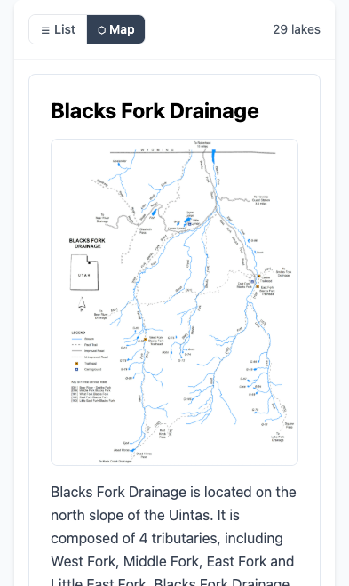

# Drainage info now shows in map view ("More about ... Drainage" fix)

*2026-08-30T03:17:45Z by Showboat 0.6.1*
<!-- showboat-id: ec99d185-e5c7-49fe-89b3-9b6250436f73 -->

Bug: from a lake modal, "More about <drainage> Drainage ->" landed on the home screen with the result set filtered to the drainage but no drainage write-up or drainage map. Root cause: view.leadHtml (the drainage block) and view.title were rendered only inside renderList(), so any user whose persisted view mode is 'map' never saw them. Fix: a #results-lead container above the list/map toggle target areas, filled by renderCurrentView() for BOTH views; renderList() no longer renders lead/title. Requirements to re-run: playwright-cli on PATH; blocks start their own server on :8876.

```bash
cd /Volumes/OLAF-EXT/jedwoodx/repos/uintas
grep -c 'id="results-lead"' index.html
grep -n 'view.leadHtml' index.html | grep -c renderList || true
grep -A3 'const leadEl' index.html | grep -c 'view.leadHtml'
```

```output
1
0
1
```

```bash
cd /Volumes/OLAF-EXT/jedwoodx/repos/uintas
pkill -f "http.server 8876" 2>/dev/null; python3 -m http.server 8876 >/dev/null 2>&1 & sleep 1
playwright-cli -s=drainfix close >/dev/null 2>&1
playwright-cli -s=drainfix open --device="iPhone 15" "http://localhost:8876/" >/dev/null 2>&1; sleep 2
# Jed's exact repro: persisted MAP view mode, open a Blacks Fork lake, tap the drainage link
playwright-cli -s=drainfix --raw eval "(() => { localStorage.setItem('uintas-view','map'); return 1; })()" >/dev/null
playwright-cli -s=drainfix reload >/dev/null 2>&1; sleep 2
playwright-cli -s=drainfix --raw eval "(() => { showLakeDetail('G-73'); [...document.querySelectorAll('#modal-content a,#modal-content button')].find(e=>/More about .* Drainage/.test(e.textContent)).click(); return 1; })()" >/dev/null; sleep 1.5
R=$(playwright-cli -s=drainfix --raw eval "(() => { const lead=document.getElementById('results-lead'); const h3s=[...lead.querySelectorAll('h3')]; const map=document.getElementById('results-map'); return (document.getElementById('lake-detail-modal').classList.contains('hidden') && !lead.classList.contains('hidden') && lead.querySelector('h2').textContent==='Blacks Fork Drainage' && !!lead.querySelector('img') && /Lakes in Blacks Fork Drainage/.test(h3s[h3s.length-1].textContent) && !document.getElementById('results-map-wrap').classList.contains('hidden') && map.querySelectorAll('.leaflet-tile').length>0 && map.querySelectorAll('.leaflet-interactive').length>20) ? 'PASS map view: drainage write-up + drainage map image + title above a live Leaflet map of its lakes' : 'FAIL'; })()")
echo "$R"; echo "$R" | grep -q PASS
```

```output
"PASS map view: drainage write-up + drainage map image + title above a live Leaflet map of its lakes"
```

```bash {image}
/private/tmp/claude-501/-Volumes-OLAF-EXT-jedwoodx-repos-uintas/fd379447-1b29-40bf-ba69-e583463eacbb/scratchpad/sb-drainage.png
```



```bash
# Regressions: list mode shows the lead once (not duplicated in the list), and a
# plain filter clears stale drainage content, leaving just its title
R1=$(playwright-cli -s=drainfix --raw eval "(() => { setView('list'); const list=document.getElementById('results-list'); const lead=document.getElementById('results-lead'); return (!lead.classList.contains('hidden') && !list.querySelector('h2') && list.querySelectorAll('[onclick^=\"showLakeDetail\"]').length>20) ? 'PASS list mode: single lead block above the cards' : 'FAIL'; })()")
echo "$R1"; echo "$R1" | grep -q PASS || exit 1
R2=$(playwright-cli -s=drainfix --raw eval "(() => { setResults(lakes.slice(0,5), { title: 'Test filter (5 lakes)' }); const lead=document.getElementById('results-lead'); return (!lead.classList.contains('hidden') && lead.textContent.trim()==='Test filter (5 lakes)' && !lead.querySelector('img')) ? 'PASS plain filter: stale drainage content cleared, title only' : 'FAIL'; })()")
echo "$R2"; echo "$R2" | grep -q PASS
playwright-cli -s=drainfix console error | tail -1
playwright-cli -s=drainfix close >/dev/null 2>&1
pkill -f "http.server 8876" 2>/dev/null
echo cleaned
```

```output
"PASS list mode: single lead block above the cards"
"PASS plain filter: stale drainage content cleared, title only"

cleaned
```
