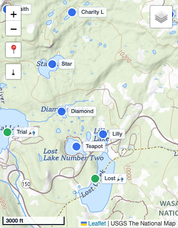

# Map pins: flag labels + bigger tap targets

*2026-08-30T03:51:41Z by Showboat 0.6.1*
<!-- showboat-id: 475c9f08-f567-4033-aa79-d3e8826d26f0 -->

Two map-view upgrades: (1) circle pins grew from radius 7 to 9; (2) pins now carry small permanent flag-style labels (Leaflet permanent tooltips, .pin-label) whenever the padded viewport holds <=30 pins - so a drainage view labels immediately while browse-all stays clean until you zoom into a basin. Labels show the short lake name (designation when unnamed) plus the caught flag, are re-evaluated on every pan/zoom, and are tap targets themselves (interactive tooltips forward clicks to the marker). Unlabeled pins keep the full-form hover tooltip. Requirements to re-run: playwright-cli on PATH; blocks start their own server on :8877.

```bash
cd /Volumes/OLAF-EXT/jedwoodx/repos/uintas
grep -c 'radius: 9' index.html
grep -c 'PIN_LABEL_MAX = 30' index.html
grep -c 'function updatePinLabels' index.html
grep -c '\.pin-label' index.html
```

```output
1
1
1
2
```

```bash
cd /Volumes/OLAF-EXT/jedwoodx/repos/uintas
pkill -f "http.server 8877" 2>/dev/null; python3 -m http.server 8877 >/dev/null 2>&1 & sleep 1
playwright-cli -s=pinlabels close >/dev/null 2>&1
playwright-cli -s=pinlabels open --device="iPhone 15" "http://localhost:8877/" >/dev/null 2>&1; sleep 2
# Drainage view in map mode: every pin labeled, radius 9
playwright-cli -s=pinlabels --raw eval "(() => { showDrainageLakes('Blacks Fork Drainage'); setView('map'); return 1; })()" >/dev/null; sleep 2
R=$(playwright-cli -s=pinlabels --raw eval "(() => { const map=document.getElementById('results-map'); const labels=[...map.querySelectorAll('.pin-label')]; const paths=[...map.querySelectorAll('path.leaflet-interactive')]; return (paths.length===27 && labels.length===27 && /a9,9/.test(paths[0].getAttribute('d'))) ? 'PASS drainage map: 27 pins at radius 9, all 27 flag-labeled' : 'FAIL ' + JSON.stringify([paths.length, labels.length]); })()")
echo "$R"; echo "$R" | grep -q PASS
```

```output
"PASS drainage map: 27 pins at radius 9, all 27 flag-labeled"
```

```bash
# Browse-all: clean at range zoom, labels appear zoomed into a basin, label tap opens the modal
playwright-cli -s=pinlabels --raw eval "(() => { showAllOnMap(); return 1; })()" >/dev/null; sleep 2
R1=$(playwright-cli -s=pinlabels --raw eval "(() => { const pins=document.querySelectorAll('#results-map path.leaflet-interactive').length; const n=document.querySelectorAll('#results-map .pin-label').length; return (pins>300 && n===0) ? 'PASS browse-all at range zoom: ' + pins + ' pins, zero labels' : 'FAIL ' + JSON.stringify([pins,n]); })()")
echo "$R1"; echo "$R1" | grep -q PASS || exit 1
playwright-cli -s=pinlabels --raw eval "(() => { resultsMap.setView([40.685, -110.94], 14); return 1; })()" >/dev/null; sleep 1.5
R2=$(playwright-cli -s=pinlabels --raw eval "(() => { const labels=[...document.querySelectorAll('#results-map .pin-label')]; return (labels.length>5 && labels.length<=30 && labels.some(l=>l.textContent.includes('Teapot'))) ? 'PASS basin zoom: ' + labels.length + ' labels appeared' : 'FAIL ' + labels.length; })()")
echo "$R2"; echo "$R2" | grep -q PASS || exit 1
playwright-cli -s=pinlabels --raw eval "(() => { [...document.querySelectorAll('#results-map .pin-label')].find(l=>l.textContent==='Teapot').dispatchEvent(new MouseEvent('click',{bubbles:true})); return 1; })()" >/dev/null; sleep 1
R3=$(playwright-cli -s=pinlabels --raw eval "(() => (!document.getElementById('lake-detail-modal').classList.contains('hidden') && document.getElementById('modal-title').textContent==='Teapot A-60') ? 'PASS label tap opens Teapot A-60 modal' : 'FAIL')()")
echo "$R3"; echo "$R3" | grep -q PASS
```

```output
"PASS browse-all at range zoom: 380 pins, zero labels"
"PASS basin zoom: 12 labels appeared"
"PASS label tap opens Teapot A-60 modal"
```

```bash
# Zoom back out: labels retract and the full-form hover tooltip is rebound (non-permanent)
playwright-cli -s=pinlabels --raw eval "(() => { closeModal(); return 1; })()" >/dev/null; sleep 1
playwright-cli -s=pinlabels --raw eval "(() => { resultsMap.setView([40.72,-110.40], 9); return 1; })()" >/dev/null; sleep 1.5
R=$(playwright-cli -s=pinlabels --raw eval "(() => { const t=pinRefs[0].marker.getTooltip(); return (document.querySelectorAll('#results-map .pin-label').length===0 && !!t && !t.options.permanent && /[A-Z]+-\d+/.test(t.getContent())) ? 'PASS range zoom again: zero labels, hover tooltip rebound with full name+designation' : 'FAIL'; })()")
echo "$R"; echo "$R" | grep -q PASS
playwright-cli -s=pinlabels console error | tail -1
```

```output
"PASS range zoom again: zero labels, hover tooltip rebound with full name+designation"

```

```bash {image}
/private/tmp/claude-501/-Volumes-OLAF-EXT-jedwoodx-repos-uintas/fd379447-1b29-40bf-ba69-e583463eacbb/scratchpad/sb-pinlabels.png
```



```bash
playwright-cli -s=pinlabels close >/dev/null 2>&1
pkill -f "http.server 8877" 2>/dev/null
echo cleaned
```

```output
cleaned
```
