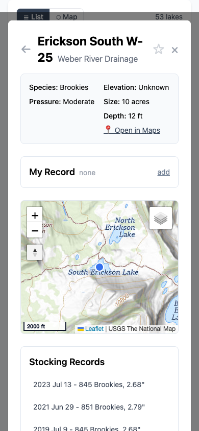
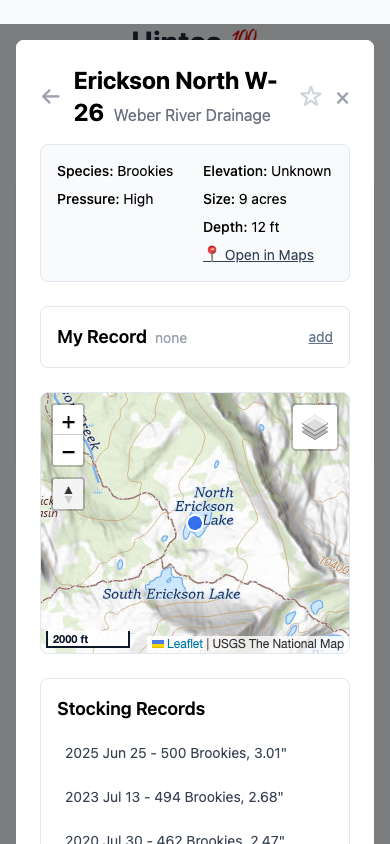
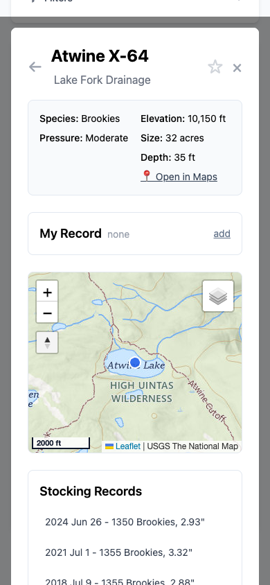
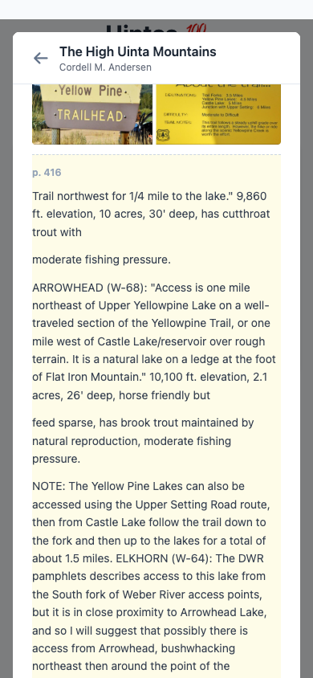
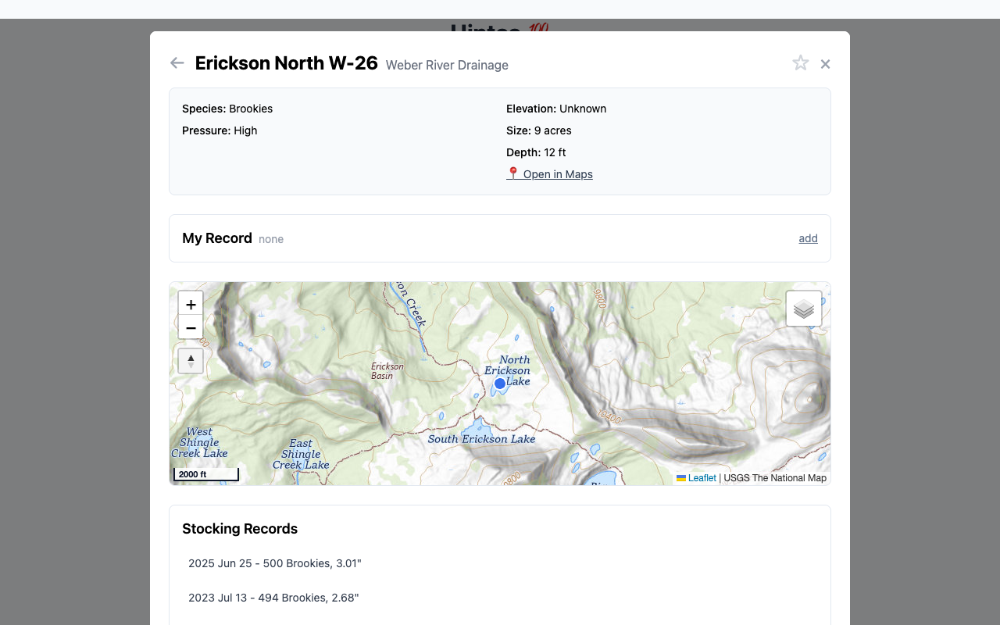

# Lake modal: in-modal back button + iOS-safe body scroll lock

*2026-08-29T23:10:32Z by Showboat 0.6.1*
<!-- showboat-id: fe8ee514-5638-4094-ba49-427526cceb78 -->

Two UX fixes to the lake detail modal in `index.html`, from heavy iPhone PWA use:

1. **Background scroll bleed** — scrolling the modal at its extremes scrolled the
   page behind it. Fixed with `overscroll-behavior: contain` on every modal card
   plus an iOS-safe body scroll lock (`lockBodyScroll`/`unlockBodyScroll`:
   position:fixed at -scrollY, exact restore on unlock, ref-counted as a Set of
   open overlay names so nested opens and lake→lake navigation can't double-lock
   or early-unlock). `history.scrollRestoration = 'manual'` keeps the browser's
   own popstate scroll restore from stomping the precise restore.
2. **← back button** in the modal's upper-left — an in-modal navigation stack of
   letter_numbers. Hike chips / trailhead chips / rotenone rows push the current
   lake; ← pops back through the trail, and with an empty stack behaves exactly
   like ×. Browser back/swipe still closes the whole modal (single history entry
   per modal is unchanged), and the in-modal CMA book viewer keeps its own
   back-arrow round trip.

**To re-run:** repo root on this machine; global `playwright-cli` (node 22+);
static server on port 8872: `python3 -m http.server 8872` from the repo root.
Each browser block is self-contained (opens and closes its own session).

## 1. Source sanity checks

```bash
echo "modal-back button in header: $(grep -c "id=\"modal-back\"" index.html)"
echo "overscroll-behavior rule:   $(grep -c "overscroll-behavior: contain" index.html)"
echo "scroll-locked CSS rule:     $(grep -c "body.scroll-locked { position: fixed" index.html)"
echo "scrollRestoration manual:   $(grep -c "history.scrollRestoration = .manual." index.html)"
echo "lock/unlock call sites:"
grep -Eo "(un)?lockBodyScroll\(" index.html | sort | uniq -c
grep -n "function modalBack|function lockBodyScroll|function unlockBodyScroll|lakeNavStack = \[\]" -E index.html
```

```output
modal-back button in header: 1
overscroll-behavior rule:   1
scroll-locked CSS rule:     1
scrollRestoration manual:   1
lock/unlock call sites:
   9 lockBodyScroll(
   8 unlockBodyScroll(
2504:        function lockBodyScroll(name) {
2513:        function unlockBodyScroll(name) {
2529:        let lakeNavStack = [];
2535:        function modalBack() {
```

```bash
curl -sf -o /dev/null http://localhost:8872/index.html && echo "server up on :8872"
```

```output
server up on :8872
```

## 2. iPhone viewport (390x844): open a lake from the list, ← at far left, ← closes

The header must read [←] [title] … [★][×]. With an empty stack, ← behaves
exactly like ×: the modal closes back to the untouched list view.

```bash
playwright-cli close >/dev/null 2>&1 || true
playwright-cli open http://localhost:8872/ >/dev/null 2>&1
playwright-cli resize 390 844 >/dev/null 2>&1
sleep 1
# open the Weber drainage list, then W-25 Erickson South from its list card
playwright-cli --raw eval "(() => { const a = [...document.querySelectorAll('#drainages-list a')].find(x => x.textContent.indexOf('Weber') !== -1); a.click(); return 'clicked drainage: ' + a.textContent.trim(); })()"
playwright-cli --raw eval "(() => { document.querySelector('#results-list [onclick*=W-25]').click(); return 'clicked list card W-25'; })()"
# header layout: back button leftmost, then title; star + close on the right
playwright-cli --raw eval "(() => { const r = id => document.getElementById(id).getBoundingClientRect(); const b = r('modal-back'), t = r('modal-title'), s = r('star-lake'), x = r('close-modal'); return JSON.stringify({modalOpen: !document.getElementById('lake-detail-modal').classList.contains('hidden'), title: document.getElementById('modal-title').textContent.trim().split(String.fromCharCode(10))[0].trim(), backLeftOfTitle: b.right <= t.left, starLeftOfClose: s.right <= x.left, closeRightmost: x.right > s.right && x.right > t.right}); })()"
playwright-cli screenshot --filename=reports/2026-08-29-modal-back-scroll/header-iphone.png >/dev/null 2>&1 && echo "captured header-iphone.png"
# empty stack: back closes the whole modal, list still there
playwright-cli --raw eval "(() => { document.getElementById('modal-back').click(); return 'clicked back'; })()"
sleep 1
playwright-cli --raw eval "(() => JSON.stringify({modalHidden: document.getElementById('lake-detail-modal').classList.contains('hidden'), listVisible: !document.getElementById('results-section').classList.contains('hidden'), bodyUnlocked: !document.body.classList.contains('scroll-locked')}))()"
playwright-cli close >/dev/null 2>&1
```

```output
"clicked drainage: Weber River Drainage • 53"
"clicked list card W-25"
"{\"modalOpen\":true,\"title\":\"Erickson South W-25\",\"backLeftOfTitle\":true,\"starLeftOfClose\":true,\"closeRightmost\":true}"
captured header-iphone.png
"clicked back"
"{\"modalHidden\":true,\"listVisible\":true,\"bodyUnlocked\":true}"
```

```bash {image}

```



## 3. Lake→lake via "Other lakes on this hike" chips, then ← walks back

W-25 Erickson South is on Falcon hike 1, which also reaches W-26, A-18, P-60 —
so its modal shows chips for those. Clicking a chip from deep in the card must
land the next lake scrolled to the top, push the previous lake on the ← stack,
and ← must walk back without re-pushing.

```bash
playwright-cli close >/dev/null 2>&1 || true
playwright-cli open http://localhost:8872/ >/dev/null 2>&1
playwright-cli resize 390 844 >/dev/null 2>&1
sleep 1
playwright-cli --raw eval "(() => { showLakeDetail('W-25'); return JSON.stringify({open: !document.getElementById('lake-detail-modal').classList.contains('hidden'), stackOnFreshOpen: [...lakeNavStack]}); })()"
# expand the hike section, scroll the card down to it, then click the W-26 chip
playwright-cli --raw eval "(() => { const d = [...document.querySelectorAll('#modal-content details')].find(x => x.textContent.indexOf('Other lakes on this hike') !== -1); d.open = true; const card = document.getElementById('lake-modal-card'); d.scrollIntoView(); const before = card.scrollTop; document.querySelector('#modal-content [onclick*=W-26]').click(); return JSON.stringify({cardScrollBeforeClick: before > 0, titleNow: document.getElementById('modal-title').textContent.trim().split(String.fromCharCode(10))[0].trim(), cardScrollAfterNav: card.scrollTop, stack: [...lakeNavStack], hash: location.hash}); })()"
playwright-cli screenshot --filename=reports/2026-08-29-modal-back-scroll/chip-nav-w26.png >/dev/null 2>&1 && echo "captured chip-nav-w26.png"
# back: pop to W-25 (no re-push), then back again closes
playwright-cli --raw eval "(() => { document.getElementById('modal-back').click(); return JSON.stringify({titleNow: document.getElementById('modal-title').textContent.trim().split(String.fromCharCode(10))[0].trim(), stack: [...lakeNavStack], hash: location.hash}); })()"
playwright-cli --raw eval "(() => { document.getElementById('modal-back').click(); return 'clicked back on empty stack'; })()"
sleep 1
playwright-cli --raw eval "(() => JSON.stringify({modalHidden: document.getElementById('lake-detail-modal').classList.contains('hidden')}))()"
playwright-cli close >/dev/null 2>&1
```

```output
"{\"open\":true,\"stackOnFreshOpen\":[]}"
"{\"cardScrollBeforeClick\":true,\"titleNow\":\"Erickson North W-26\",\"cardScrollAfterNav\":0,\"stack\":[\"W-25\"],\"hash\":\"#W-26\"}"
captured chip-nav-w26.png
"{\"titleNow\":\"Erickson South W-25\",\"stack\":[],\"hash\":\"#W-25\"}"
"clicked back on empty stack"
"{\"modalHidden\":true}"
```

```bash {image}

```



## 4. Three lakes deep: ← ← ← walks all the way back, then closes; × always closes at once

W-25 → W-26 → A-18 → P-60 by chips. Four ← presses: three pops, then close.
Then re-nest and hit × directly: the whole modal closes in one tap and the
stack is gone — a fresh reopen plus ← closes immediately.

```bash
playwright-cli close >/dev/null 2>&1 || true
playwright-cli open http://localhost:8872/ >/dev/null 2>&1
playwright-cli resize 390 844 >/dev/null 2>&1
sleep 1
playwright-cli --raw eval "(() => { showLakeDetail('W-25'); document.querySelector('#modal-content [onclick*=W-26]').click(); document.querySelector('#modal-content [onclick*=A-18]').click(); document.querySelector('#modal-content [onclick*=P-60]').click(); return JSON.stringify({stack: [...lakeNavStack], hash: location.hash}); })()"
playwright-cli --raw eval "(() => { const back = () => document.getElementById('modal-back').click(); back(); const a = location.hash; back(); const b = location.hash; back(); const c = location.hash; return JSON.stringify({popTrail: [a, b, c], stack: [...lakeNavStack]}); })()"
playwright-cli --raw eval "(() => { document.getElementById('modal-back').click(); return 'fourth back press'; })()"
sleep 1
playwright-cli --raw eval "(() => JSON.stringify({modalHidden: document.getElementById('lake-detail-modal').classList.contains('hidden')}))()"
# re-nest two deep, then close with the X: everything closes at once
playwright-cli --raw eval "(() => { showLakeDetail('W-25'); document.querySelector('#modal-content [onclick*=W-26]').click(); document.querySelector('#modal-content [onclick*=A-18]').click(); document.getElementById('close-modal').click(); return JSON.stringify({stackAtCloseTap: 2}); })()"
sleep 1
playwright-cli --raw eval "(() => JSON.stringify({modalHidden: document.getElementById('lake-detail-modal').classList.contains('hidden'), stackCleared: lakeNavStack.length === 0}))()"
# fresh reopen: stack must be empty, so one back press closes immediately
playwright-cli --raw eval "(() => { showLakeDetail('BR-25'); return JSON.stringify({stackOnFreshOpen: [...lakeNavStack]}); })()"
playwright-cli --raw eval "(() => { document.getElementById('modal-back').click(); return 'back on fresh open'; })()"
sleep 1
playwright-cli --raw eval "(() => JSON.stringify({modalHidden: document.getElementById('lake-detail-modal').classList.contains('hidden')}))()"
playwright-cli close >/dev/null 2>&1
```

```output
"{\"stack\":[\"W-25\",\"W-26\",\"A-18\"],\"hash\":\"#P-60\"}"
"{\"popTrail\":[\"#A-18\",\"#W-26\",\"#W-25\"],\"stack\":[]}"
"fourth back press"
"{\"modalHidden\":true}"
"{\"stackAtCloseTap\":2}"
"{\"modalHidden\":true,\"stackCleared\":true}"
"{\"stackOnFreshOpen\":[]}"
"back on fresh open"
"{\"modalHidden\":true}"
```

## 5. Map view: pin → modal, ← closes back to the still-rendered map

```bash
playwright-cli close >/dev/null 2>&1 || true
playwright-cli open http://localhost:8872/ >/dev/null 2>&1
playwright-cli resize 390 844 >/dev/null 2>&1
sleep 1
playwright-cli --raw eval "(() => { document.getElementById('map-all').click(); return 'clicked Browse all lakes on the map'; })()"
sleep 2
playwright-cli --raw eval "(() => { const pins = document.querySelectorAll('#results-map path.leaflet-interactive'); pins[10].dispatchEvent(new MouseEvent('click', {bubbles: true})); return JSON.stringify({mapVisible: !document.getElementById('results-map-wrap').classList.contains('hidden'), pinsRendered: pins.length > 100, modalOpenFromPin: !document.getElementById('lake-detail-modal').classList.contains('hidden'), stackOnFreshOpen: [...lakeNavStack], bodyLocked: document.body.classList.contains('scroll-locked')}); })()"
playwright-cli screenshot --filename=reports/2026-08-29-modal-back-scroll/pin-modal.png >/dev/null 2>&1 && echo "captured pin-modal.png"
playwright-cli --raw eval "(() => { document.getElementById('modal-back').click(); return 'clicked back'; })()"
sleep 1
playwright-cli --raw eval "(() => JSON.stringify({modalHidden: document.getElementById('lake-detail-modal').classList.contains('hidden'), mapStillVisible: !document.getElementById('results-map-wrap').classList.contains('hidden'), mapStillHasPins: document.querySelectorAll('#results-map path.leaflet-interactive').length > 100, bodyUnlocked: !document.body.classList.contains('scroll-locked')}))()"
playwright-cli close >/dev/null 2>&1
```

```output
"clicked Browse all lakes on the map"
"{\"mapVisible\":true,\"pinsRendered\":true,\"modalOpenFromPin\":true,\"stackOnFreshOpen\":[],\"bodyLocked\":true}"
captured pin-modal.png
"clicked back"
"{\"modalHidden\":true,\"mapStillVisible\":true,\"mapStillHasPins\":true,\"bodyUnlocked\":true}"
```

```bash {image}

```



## 6. Body scroll lock: exact freeze + exact restore, and the lock pairs correctly

Scroll the list to 600px, open a lake: body must be position:fixed at top:-600px
and the modal card must have overscroll-behavior:contain. Close: page scroll
restored to exactly 600. Then About and Sync modals each lock/unlock cleanly —
no stuck lock after everything is closed.

```bash
playwright-cli close >/dev/null 2>&1 || true
playwright-cli open http://localhost:8872/ >/dev/null 2>&1
playwright-cli resize 390 844 >/dev/null 2>&1
sleep 1
playwright-cli --raw eval "(() => { [...document.querySelectorAll('#drainages-list a')].find(x => x.textContent.indexOf('Weber') !== -1).click(); window.scrollTo(0, 600); return 'list open, page scrolled to ' + window.scrollY; })()"
playwright-cli --raw eval "(() => { document.querySelector('#results-list [onclick*=W-25]').click(); const card = document.getElementById('lake-modal-card'); return JSON.stringify({bodyPosition: getComputedStyle(document.body).position, bodyTop: document.body.style.top, cardOverscroll: getComputedStyle(card).overscrollBehavior}); })()"
playwright-cli --raw eval "(() => { document.getElementById('close-modal').click(); return 'closed via x'; })()"
sleep 1
playwright-cli --raw eval "(() => JSON.stringify({scrollRestoredTo: window.scrollY, bodyPosition: getComputedStyle(document.body).position, bodyTopCleared: document.body.style.top === ''}))()"
# About and Sync modals: lock while open, fully released after
playwright-cli --raw eval "(() => { openAboutModal(); const dur = document.body.classList.contains('scroll-locked'); closeAboutModal(); return 'about locked while open: ' + dur; })()"
sleep 1
playwright-cli --raw eval "(() => { openSyncModal(); const dur = document.body.classList.contains('scroll-locked'); closeSyncModal(); return 'sync locked while open: ' + dur; })()"
sleep 1
playwright-cli --raw eval "(() => { window.scrollTo(0, 350); return JSON.stringify({noStuckLock: !document.body.classList.contains('scroll-locked'), bodyPosition: getComputedStyle(document.body).position, pageScrollsAgain: window.scrollY === 350, scrollPreservedThroughAboutSync: true}); })()"
playwright-cli close >/dev/null 2>&1
```

```output
"list open, page scrolled to 600"
"{\"bodyPosition\":\"fixed\",\"bodyTop\":\"-600px\",\"cardOverscroll\":\"contain\"}"
"closed via x"
"{\"scrollRestoredTo\":600,\"bodyPosition\":\"static\",\"bodyTopCleared\":true}"
"about locked while open: true"
"sync locked while open: true"
"{\"noStuckLock\":true,\"bodyPosition\":\"static\",\"pageScrollsAgain\":true,\"scrollPreservedThroughAboutSync\":true}"
```

## 7. CMA book-view regression: book round trip preserves scroll AND the ← stack

W-25 → chip → W-26 (stack: [W-25]). From W-26, tap its "(p. 416)" citation:
the in-modal book viewer opens (its own history entry, its own back arrow).
The book's ← must return to W-26 with the card scroll restored — and the lake
modal's ← stack must still hold W-25, so lake-← still walks W-26 → W-25 → closed.

```bash
playwright-cli close >/dev/null 2>&1 || true
playwright-cli open http://localhost:8872/ >/dev/null 2>&1
playwright-cli resize 390 844 >/dev/null 2>&1
sleep 1
playwright-cli --raw eval "(() => { showLakeDetail('W-25'); document.querySelector('#modal-content [onclick*=W-26]').click(); const card = document.getElementById('lake-modal-card'); card.scrollTop = 300; const link = document.querySelector('#modal-content a[onclick*=openBookPage]'); link.click(); return JSON.stringify({citation: link.textContent, stackBeforeBook: [...lakeNavStack]}); })()"
sleep 2
playwright-cli --raw eval "(() => JSON.stringify({bookVisible: !document.getElementById('book-view').classList.contains('hidden'), lakeViewHidden: document.getElementById('lake-view').classList.contains('hidden'), hash: location.hash, bodyStillLocked: document.body.classList.contains('scroll-locked')}))()"
playwright-cli screenshot --filename=reports/2026-08-29-modal-back-scroll/book-view.png >/dev/null 2>&1 && echo "captured book-view.png"
# the book viewer's own back arrow: return to the lake, scroll restored
playwright-cli --raw eval "(() => { document.getElementById('book-back').click(); return 'clicked book back arrow'; })()"
sleep 1
playwright-cli --raw eval "(() => JSON.stringify({lakeViewBack: !document.getElementById('lake-view').classList.contains('hidden'), cardScrollRestored: document.getElementById('lake-modal-card').scrollTop === 300, hash: location.hash, stackSurvivedBookTrip: [...lakeNavStack]}))()"
# and the lake modal's own back stack still works after the book round trip
playwright-cli --raw eval "(() => { document.getElementById('modal-back').click(); return JSON.stringify({poppedTo: location.hash, stack: [...lakeNavStack]}); })()"
playwright-cli --raw eval "(() => { document.getElementById('modal-back').click(); return 'final back'; })()"
sleep 1
playwright-cli --raw eval "(() => JSON.stringify({modalHidden: document.getElementById('lake-detail-modal').classList.contains('hidden'), bodyUnlocked: !document.body.classList.contains('scroll-locked')}))()"
playwright-cli close >/dev/null 2>&1
```

```output
"{\"citation\":\"(p. 416)\",\"stackBeforeBook\":[\"W-25\"]}"
"{\"bookVisible\":true,\"lakeViewHidden\":true,\"hash\":\"#book-p416\",\"bodyStillLocked\":true}"
captured book-view.png
"clicked book back arrow"
"{\"lakeViewBack\":true,\"cardScrollRestored\":true,\"hash\":\"#W-26\",\"stackSurvivedBookTrip\":[\"W-25\"]}"
"{\"poppedTo\":\"#W-25\",\"stack\":[]}"
"final back"
"{\"modalHidden\":true,\"bodyUnlocked\":true}"
```

```bash {image}

```



## 8. Desktop pass (1280x800) + rotenone→lake lock handoff

Same behavior at desktop size. Also the one cross-modal transition in the app:
a rotenone-report row swaps that modal for the lake modal — the body must stay
locked through the handoff (no flicker-unlock) and release fully at the end.

```bash
playwright-cli close >/dev/null 2>&1 || true
playwright-cli open http://localhost:8872/ >/dev/null 2>&1
playwright-cli resize 1280 800 >/dev/null 2>&1
sleep 1
playwright-cli --raw eval "(() => { [...document.querySelectorAll('#drainages-list a')].find(x => x.textContent.indexOf('Weber') !== -1).click(); document.querySelector('#results-list [onclick*=W-25]').click(); document.querySelector('#modal-content [onclick*=W-26]').click(); return JSON.stringify({stack: [...lakeNavStack], hash: location.hash, bodyLocked: document.body.classList.contains('scroll-locked'), cardOverscroll: getComputedStyle(document.getElementById('lake-modal-card')).overscrollBehavior}); })()"
playwright-cli screenshot --filename=reports/2026-08-29-modal-back-scroll/desktop-modal.png >/dev/null 2>&1 && echo "captured desktop-modal.png"
playwright-cli --raw eval "(() => { document.getElementById('modal-back').click(); return JSON.stringify({poppedTo: location.hash, stack: [...lakeNavStack]}); })()"
playwright-cli --raw eval "(() => { document.getElementById('modal-back').click(); return 'back on empty stack'; })()"
sleep 1
playwright-cli --raw eval "(() => JSON.stringify({modalHidden: document.getElementById('lake-detail-modal').classList.contains('hidden')}))()"
# rotenone report -> lake row: lock hands off, never drops
playwright-cli --raw eval "(() => { openRotenoneModal(); const lockedDuringRotenone = document.body.classList.contains('scroll-locked'); document.querySelector('#rotenone-content [onclick*=openLakeFromRotenone]').click(); return JSON.stringify({lockedDuringRotenone, rotenoneHidden: document.getElementById('rotenone-modal').classList.contains('hidden'), lakeOpen: !document.getElementById('lake-detail-modal').classList.contains('hidden'), stillLockedAfterHandoff: document.body.classList.contains('scroll-locked'), stackOnFreshOpen: [...lakeNavStack]}); })()"
playwright-cli --raw eval "(() => { document.getElementById('close-modal').click(); return 'closed'; })()"
sleep 1
playwright-cli --raw eval "(() => JSON.stringify({everythingHidden: document.getElementById('lake-detail-modal').classList.contains('hidden') && document.getElementById('rotenone-modal').classList.contains('hidden'), bodyFullyUnlocked: !document.body.classList.contains('scroll-locked')}))()"
playwright-cli close >/dev/null 2>&1
```

```output
"{\"stack\":[\"W-25\"],\"hash\":\"#W-26\",\"bodyLocked\":true,\"cardOverscroll\":\"contain\"}"
captured desktop-modal.png
"{\"poppedTo\":\"#W-25\",\"stack\":[]}"
"back on empty stack"
"{\"modalHidden\":true}"
"{\"lockedDuringRotenone\":true,\"rotenoneHidden\":true,\"lakeOpen\":true,\"stillLockedAfterHandoff\":true,\"stackOnFreshOpen\":[]}"
"closed"
"{\"everythingHidden\":true,\"bodyFullyUnlocked\":true}"
```

```bash {image}

```



## Result

All scenarios pass on both viewports:

- ← sits at the far left of the modal header; ★/× unchanged top-right.
- Chip navigation pushes the previous lake; ← pops without re-pushing; the URL
  hash follows every hop (replace semantics — browser back/swipe still closes
  the modal outright, as before).
- × / backdrop / Escape close the whole modal at once and clear the stack.
- Body is frozen (`position:fixed`, `top:-scrollY`) while any overlay is open,
  released to the exact scroll position on close; About/Sync/Offline/Rotenone/
  stocking-report all pair their locks; the rotenone→lake handoff never drops it.
- `overscroll-behavior: contain` on every modal card stops scroll chaining.
- The CMA book viewer round trip (own history entry, own back arrow, scroll
  restore) is unaffected, and the ← stack survives it.
