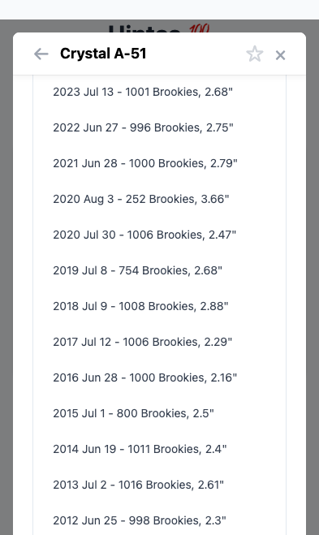
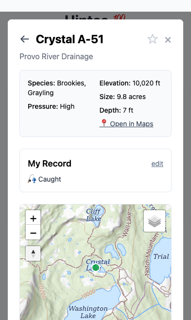

# Lake modal: iOS-style sticky condensing header

*2026-08-30T02:58:36Z by Showboat 0.6.1*
<!-- showboat-id: 1613845b-4562-40f0-a69b-dc9429c3ba8f -->

The lake modal header (back arrow, title, star, close) is now position:sticky inside the scrolling card, so back/close are reachable from any scroll depth. It condenses iOS-style once scrolled past 32px (title 24px -> 18px, tighter padding, hairline shadow) and re-expands near the top (below 8px; the dead band prevents flicker). The drainage line moved out of the header into the scroll flow. Requirements to re-run: playwright-cli on PATH; blocks start their own static server on :8875.

```bash
cd /Volumes/OLAF-EXT/jedwoodx/repos/uintas
grep -c 'id="lake-modal-header"' index.html
grep -c 'position: sticky; top: 0; z-index: 1050;' index.html
grep -c "classList.add('condensed')" index.html
grep -c 'id="modal-drainage"' index.html
```

```output
1
1
1
1
```

```bash
cd /Volumes/OLAF-EXT/jedwoodx/repos/uintas
pkill -f "http.server 8875" 2>/dev/null; python3 -m http.server 8875 >/dev/null 2>&1 & sleep 1
playwright-cli -s=stickyhdr close >/dev/null 2>&1
playwright-cli -s=stickyhdr open --device="iPhone 15" "http://localhost:8875/#A-51" >/dev/null 2>&1; sleep 2
R=$(playwright-cli -s=stickyhdr --raw eval "(() => { const h=document.getElementById('lake-modal-header'); const cs=getComputedStyle(h); const t=getComputedStyle(document.getElementById('modal-title')).fontSize; const d=document.getElementById('modal-drainage'); return (cs.position==='sticky' && cs.zIndex==='1050' && !h.classList.contains('condensed') && t==='24px' && d.textContent==='Provo River Drainage' && !d.classList.contains('hidden')) ? 'PASS initial: sticky header, large 24px title, drainage in scroll flow' : 'FAIL ' + JSON.stringify([cs.position, cs.zIndex, h.className, t, d.textContent]); })()")
echo "$R"; echo "$R" | grep -q PASS
```

```output
"PASS initial: sticky header, large 24px title, drainage in scroll flow"
```

```bash
playwright-cli -s=stickyhdr --raw eval "(() => { document.getElementById('lake-modal-card').scrollTop = 800; return 1; })()" >/dev/null; sleep 0.5
R=$(playwright-cli -s=stickyhdr --raw eval "(() => { const h=document.getElementById('lake-modal-header'); const r=h.getBoundingClientRect(); const c=document.getElementById('lake-modal-card').getBoundingClientRect(); const t=getComputedStyle(document.getElementById('modal-title')).fontSize; const back=document.getElementById('modal-back').getBoundingClientRect().height>0; const x=document.getElementById('close-modal').getBoundingClientRect().height>0; return (h.classList.contains('condensed') && t==='18px' && Math.abs(r.top-c.top)<2 && Math.round(r.height)<=56 && back && x) ? 'PASS deep scroll: condensed 18px single line pinned to card top, back+close reachable' : 'FAIL ' + JSON.stringify([h.className, t, r.top, c.top, r.height]); })()")
echo "$R"; echo "$R" | grep -q PASS
```

```output
"PASS deep scroll: condensed 18px single line pinned to card top, back+close reachable"
```

```bash {image}
/private/tmp/claude-501/-Volumes-OLAF-EXT-jedwoodx-repos-uintas/fd379447-1b29-40bf-ba69-e583463eacbb/scratchpad/sb-condensed.png
```



```bash
# The point of the feature: close from the very bottom without scrolling up
playwright-cli -s=stickyhdr --raw eval "(() => { document.getElementById('lake-modal-card').scrollTop = 99999; return 1; })()" >/dev/null; sleep 0.4
playwright-cli -s=stickyhdr click "#close-modal" >/dev/null 2>&1; sleep 1
R=$(playwright-cli -s=stickyhdr --raw eval "(() => (document.getElementById('lake-detail-modal').classList.contains('hidden') && getComputedStyle(document.body).position==='static') ? 'PASS close-from-bottom: modal closed via sticky x, body scroll unlocked' : 'FAIL')()")
echo "$R"; echo "$R" | grep -q PASS
```

```output
"PASS close-from-bottom: modal closed via sticky x, body scroll unlocked"
```

```bash
# Lake->lake nav from deep scroll opens the next lake with the large header (no condensed flash),
# and the sticky back arrow still pops the in-modal trail
playwright-cli -s=stickyhdr --raw eval "(() => { showLakeDetail('A-51'); document.getElementById('lake-modal-card').scrollTop=900; return 1; })()" >/dev/null; sleep 0.4
R1=$(playwright-cli -s=stickyhdr --raw eval "(() => { [...document.querySelectorAll('#modal-content button')].find(b=>b.textContent.trim()==='A-37').click(); const h=document.getElementById('lake-modal-header'); return (document.getElementById('modal-title').textContent==='Long A-37' && !h.classList.contains('condensed') && document.getElementById('lake-modal-card').scrollTop===0 && document.getElementById('modal-drainage').textContent==='Provo River Drainage') ? 'PASS chip nav: A-37 opens at top, header large again' : 'FAIL'; })()")
echo "$R1"; echo "$R1" | grep -q PASS || exit 1
playwright-cli -s=stickyhdr --raw eval "(() => { document.getElementById('lake-modal-card').scrollTop=700; return 1; })()" >/dev/null; sleep 0.4
playwright-cli -s=stickyhdr click "#modal-back" >/dev/null 2>&1; sleep 0.5
R2=$(playwright-cli -s=stickyhdr --raw eval "(() => (document.getElementById('modal-title').textContent==='Crystal A-51' && !document.getElementById('lake-modal-header').classList.contains('condensed')) ? 'PASS sticky back arrow from deep scroll returns to A-51' : 'FAIL')()")
echo "$R2"; echo "$R2" | grep -q PASS
```

```output
"PASS chip nav: A-37 opens at top, header large again"
"PASS sticky back arrow from deep scroll returns to A-51"
```

```bash
# Regression: CMA book viewer round trip — scroll position restored, header re-syncs to that depth
playwright-cli -s=stickyhdr --raw eval "(() => { showLakeDetail('X-81'); document.getElementById('lake-modal-card').scrollTop=400; return 1; })()" >/dev/null; sleep 0.4
playwright-cli -s=stickyhdr --raw eval "(() => { openBookPage(356); return 1; })()" >/dev/null; sleep 2
playwright-cli -s=stickyhdr click "#book-back" >/dev/null 2>&1; sleep 1
R=$(playwright-cli -s=stickyhdr --raw eval "(() => { const st=document.getElementById('lake-modal-card').scrollTop; return (!document.getElementById('lake-view').classList.contains('hidden') && document.getElementById('modal-title').textContent==='Hook X-81' && st>300 && document.getElementById('lake-modal-header').classList.contains('condensed')) ? 'PASS book round trip: back on X-81 at restored depth, header condensed to match' : 'FAIL scrollTop=' + st; })()")
echo "$R"; echo "$R" | grep -q PASS
```

```output
"PASS book round trip: back on X-81 at restored depth, header condensed to match"
```

```bash
# Scroll back to the very top: header expands to the large state
playwright-cli -s=stickyhdr --raw eval "(() => { document.getElementById('lake-modal-card').scrollTop=0; return 1; })()" >/dev/null; sleep 0.5
R=$(playwright-cli -s=stickyhdr --raw eval "(() => (!document.getElementById('lake-modal-header').classList.contains('condensed') && getComputedStyle(document.getElementById('modal-title')).fontSize==='24px') ? 'PASS re-expanded at top: 24px title' : 'FAIL')()")
echo "$R"; echo "$R" | grep -q PASS
```

```output
"PASS re-expanded at top: 24px title"
```

```bash {image}
/private/tmp/claude-501/-Volumes-OLAF-EXT-jedwoodx-repos-uintas/fd379447-1b29-40bf-ba69-e583463eacbb/scratchpad/sb-large.png
```



```bash
# Cleanup: close the test browser and release the port; zero console errors during the whole run
playwright-cli -s=stickyhdr console error | tail -1
playwright-cli -s=stickyhdr close >/dev/null 2>&1
pkill -f "http.server 8875" 2>/dev/null
echo cleaned
```

```output

cleaned
```
